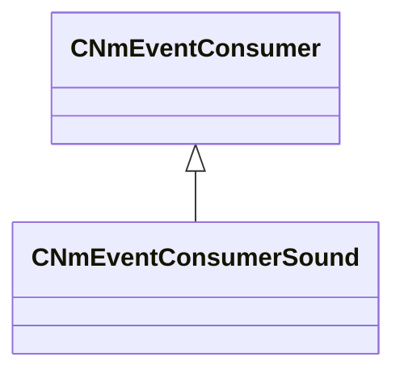

[Schemas](../../schemas.md) / [server](../server.md) / CNmEventConsumerSound

# CNmEventConsumerSound

**Kind:** class · **Size:** 184 bytes (`0xb8`) · **Align:** 8 · **Module:** server

**Inherits from:** [CNmEventConsumer](../server/CNmEventConsumer.md)

**Relationships:**

KV3 class defaults

<pre>{
	&quot;_class&quot;: &quot;CNmEventConsumerSound&quot;
}</pre>

