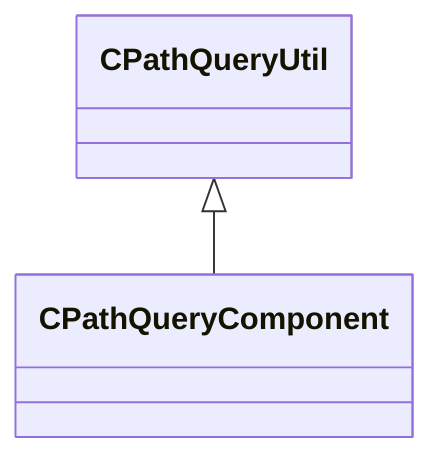

[Schemas](../../schemas.md) / [server](../server.md) / CPathQueryUtil

# CPathQueryUtil

> Source: **Build 25000182** · 2026-08-28 · `windows-x86_64` · schema `0.10.0`

**Kind:** class · **Size:** 128 bytes (`0x80`) · **Align:** n/a (unspecified) · **Module:** server

**Derived by:** [CPathQueryComponent](../server/CPathQueryComponent.md), [CPathQueryComponent](../server/CPathQueryComponent.md)

**Relationships:**

## Memory layout

5 fields (5 declared here, 0 inherited). Offsets are absolute from the object base.

| Offset | Field | Type | From | Annotations |
|--------|-------|------|------|-------------|
| `0x10` | `m_PathToEntityTransform` | CTransform |  |  |
| `0x30` | `m_vecPathSamplePositions` | CUtlVector< Vector > |  |  |
| `0x48` | `m_vecPathSampleParameters` | CUtlVector< float32 > |  |  |
| `0x60` | `m_vecPathSampleDistances` | CUtlVector< float32 > |  |  |
| `0x78` | `m_bIsClosedLoop` | bool |  |  |
