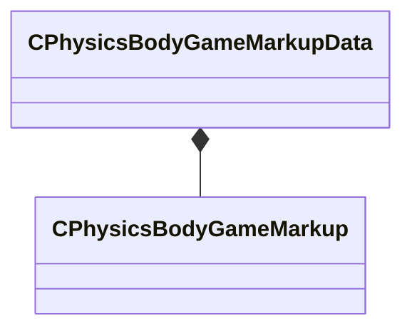

[Schemas](../../schemas.md) / [server](../server.md) / CPhysicsBodyGameMarkupData

# CPhysicsBodyGameMarkupData

**Kind:** class · **Size:** 40 bytes (`0x28`) · **Align:** 8 · **Module:** server

**Metadata:** `MModelGameData`

**Relationships:**

## Memory layout

1 fields (1 declared here, 0 inherited). Offsets are absolute from the object base.

| Offset | Field | Type | From | Annotations |
|--------|-------|------|------|-------------|
| `0x0` | `m_PhysicsBodyMarkupByBoneName` | CUtlDict< [CPhysicsBodyGameMarkup](../server/CPhysicsBodyGameMarkup.md) > |  | `MPropertyDescription Physics Body Data By Bone Name` |

KV3 class defaults

<pre>{
	&quot;m_PhysicsBodyMarkupByBoneName&quot;:
	{
	}
}</pre>

