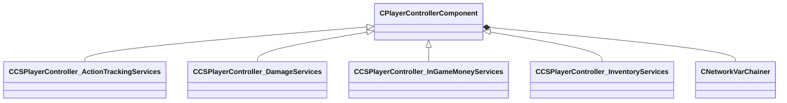

[Schemas](../../schemas.md) / [server](../server.md) / CPlayerControllerComponent

# CPlayerControllerComponent

> Source: **Build 25000182** · 2026-08-28 · `windows-x86_64` · schema `0.10.0`

**Kind:** class · **Size:** 64 bytes (`0x40`) · **Align:** n/a (unspecified) · **Module:** server

**Derived by:** [CCSPlayerController_ActionTrackingServices](../server/CCSPlayerController_ActionTrackingServices.md), [CCSPlayerController_ActionTrackingServices](../server/CCSPlayerController_ActionTrackingServices.md), [CCSPlayerController_DamageServices](../server/CCSPlayerController_DamageServices.md), [CCSPlayerController_DamageServices](../server/CCSPlayerController_DamageServices.md), [CCSPlayerController_InGameMoneyServices](../server/CCSPlayerController_InGameMoneyServices.md), [CCSPlayerController_InGameMoneyServices](../server/CCSPlayerController_InGameMoneyServices.md), [CCSPlayerController_InventoryServices](../server/CCSPlayerController_InventoryServices.md), [CCSPlayerController_InventoryServices](../server/CCSPlayerController_InventoryServices.md)

**Relationships:**

## Memory layout

1 field (1 declared here, 0 inherited). Offsets are absolute from the object base.

| Offset | Field | Type | From | Annotations |
|--------|-------|------|------|-------------|
| `0x8` | `__m_pChainEntity` | [CNetworkVarChainer](../entity2/CNetworkVarChainer.md) |  | `MNotSaved` |
