[Schemas](../../schemas.md) / [server](../server.md) / CPlayerPawnComponent

# CPlayerPawnComponent

> Source: **Build 25000182** · 2026-08-28 · `windows-x86_64` · schema `0.10.0`

**Kind:** class · **Size:** 72 bytes (`0x48`) · **Align:** n/a (unspecified) · **Module:** server

**Derived by:** [CCSPlayer_ActionTrackingServices](../server/CCSPlayer_ActionTrackingServices.md), [CCSPlayer_ActionTrackingServices](../server/CCSPlayer_ActionTrackingServices.md), [CCSPlayer_AimPunchServices](../server/CCSPlayer_AimPunchServices.md), [CCSPlayer_AimPunchServices](../server/CCSPlayer_AimPunchServices.md), [CCSPlayer_BulletServices](../server/CCSPlayer_BulletServices.md), [CCSPlayer_BulletServices](../server/CCSPlayer_BulletServices.md), [CCSPlayer_BuyServices](../server/CCSPlayer_BuyServices.md), [CCSPlayer_BuyServices](../server/CCSPlayer_BuyServices.md), [CCSPlayer_DamageReactServices](../server/CCSPlayer_DamageReactServices.md), [CCSPlayer_DamageReactServices](../server/CCSPlayer_DamageReactServices.md), [CCSPlayer_GlowServices](../client/CCSPlayer_GlowServices.md), [CCSPlayer_HostageServices](../server/CCSPlayer_HostageServices.md), [CCSPlayer_HostageServices](../server/CCSPlayer_HostageServices.md), [CCSPlayer_PingServices](../server/CCSPlayer_PingServices.md), [CCSPlayer_PingServices](../server/CCSPlayer_PingServices.md), [CCSPlayer_RadioServices](../server/CCSPlayer_RadioServices.md), [CPlayer_AutoaimServices](../server/CPlayer_AutoaimServices.md), [CPlayer_AutoaimServices](../server/CPlayer_AutoaimServices.md), [CPlayer_CameraServices](../server/CPlayer_CameraServices.md), [CPlayer_CameraServices](../server/CPlayer_CameraServices.md), [CPlayer_FlashlightServices](../server/CPlayer_FlashlightServices.md), [CPlayer_FlashlightServices](../server/CPlayer_FlashlightServices.md), [CPlayer_ItemServices](../server/CPlayer_ItemServices.md), [CPlayer_ItemServices](../server/CPlayer_ItemServices.md), [CPlayer_MovementServices](../server/CPlayer_MovementServices.md), [CPlayer_MovementServices](../server/CPlayer_MovementServices.md), [CPlayer_ObserverServices](../server/CPlayer_ObserverServices.md), [CPlayer_ObserverServices](../server/CPlayer_ObserverServices.md), [CPlayer_UseServices](../server/CPlayer_UseServices.md), [CPlayer_UseServices](../server/CPlayer_UseServices.md), [CPlayer_WaterServices](../server/CPlayer_WaterServices.md), [CPlayer_WaterServices](../server/CPlayer_WaterServices.md), [CPlayer_WeaponServices](../server/CPlayer_WeaponServices.md), [CPlayer_WeaponServices](../server/CPlayer_WeaponServices.md)

**Relationships:**

```mermaid
classDiagram
    CPlayerPawnComponent <|-- CCSPlayer_ActionTrackingServices
    CPlayerPawnComponent <|-- CCSPlayer_AimPunchServices
    CPlayerPawnComponent <|-- CCSPlayer_BulletServices
    CPlayerPawnComponent <|-- CCSPlayer_BuyServices
    CPlayerPawnComponent <|-- CCSPlayer_DamageReactServices
    CPlayerPawnComponent <|-- CCSPlayer_GlowServices
    CPlayerPawnComponent <|-- CCSPlayer_HostageServices
    CPlayerPawnComponent <|-- CCSPlayer_PingServices
    CPlayerPawnComponent <|-- CPlayer_AutoaimServices
    CPlayerPawnComponent <|-- CPlayer_CameraServices
    CPlayerPawnComponent <|-- CPlayer_FlashlightServices
    CPlayerPawnComponent <|-- CPlayer_ItemServices
    CPlayerPawnComponent <|-- CPlayer_MovementServices
    CPlayerPawnComponent <|-- CPlayer_ObserverServices
    CPlayerPawnComponent <|-- CPlayer_UseServices
    CPlayerPawnComponent <|-- CPlayer_WaterServices
    CPlayerPawnComponent <|-- CPlayer_WeaponServices
    CPlayerPawnComponent <|-- CCSPlayer_RadioServices
    CPlayerPawnComponent *-- CNetworkVarChainer
    CPlayerPawnComponent *-- CAnimGraphControllerPtr
```

## Memory layout

2 fields (2 declared here, 0 inherited). Offsets are absolute from the object base.

| Offset | Field | Type | From | Annotations |
|--------|-------|------|------|-------------|
| `0x8` | `__m_pChainEntity` | [CNetworkVarChainer](../entity2/CNetworkVarChainer.md) |  | `MNotSaved` |
| `0x30` | `m_pComponentGraphController` | [CAnimGraphControllerPtr](../server/CAnimGraphControllerPtr.md) |  |  |
