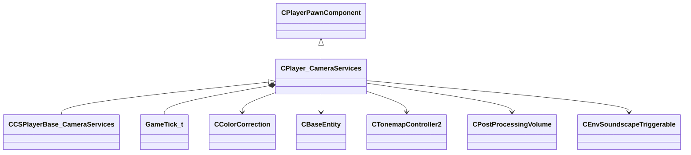

[Schemas](../../schemas.md) / [server](../server.md) / CPlayer_CameraServices

# CPlayer_CameraServices

**Kind:** class · **Size:** 376 bytes (`0x178`) · **Align:** 255 · **Module:** server

**Inherits from:** [CPlayerPawnComponent](../server/CPlayerPawnComponent.md)

**Derived by:** [CCSPlayerBase_CameraServices](../server/CCSPlayerBase_CameraServices.md)

**Relationships:**

## Memory layout

14 fields (12 declared here, 2 inherited). Offsets are absolute from the object base.

| Offset | Field | Type | From | Annotations |
|--------|-------|------|------|-------------|
| `0x8` | `__m_pChainEntity` | [CNetworkVarChainer](../entity2/CNetworkVarChainer.md) | [CPlayerPawnComponent](../server/CPlayerPawnComponent.md) | `MNotSaved` |
| `0x30` | `m_pComponentGraphController` | [CAnimGraphControllerPtr](../server/CAnimGraphControllerPtr.md) | [CPlayerPawnComponent](../server/CPlayerPawnComponent.md) |  |
| `0x48` | `m_vecCsViewPunchAngle` | QAngle |  |  |
| `0x54` | `m_nCsViewPunchAngleTick` | [GameTick_t](../entity2/GameTick_t.md) |  |  |
| `0x58` | `m_flCsViewPunchAngleTickRatio` | float32 |  |  |
| `0x60` | `m_PlayerFog` | fogplayerparams_t |  |  |
| `0xa0` | `m_hColorCorrectionCtrl` | CHandle< [CColorCorrection](../server/CColorCorrection.md) > |  |  |
| `0xa4` | `m_hViewEntity` | CHandle< [CBaseEntity](../server/CBaseEntity.md) > |  |  |
| `0xa8` | `m_hTonemapController` | CHandle< [CTonemapController2](../server/CTonemapController2.md) > |  |  |
| `0xb0` | `m_audio` | audioparams_t |  |  |
| `0x128` | `m_PostProcessingVolumes` | CNetworkUtlVectorBase< CHandle< [CPostProcessingVolume](../server/CPostProcessingVolume.md) > > |  |  |
| `0x140` | `m_flOldPlayerZ` | float32 |  |  |
| `0x144` | `m_flOldPlayerViewOffsetZ` | float32 |  |  |
| `0x160` | `m_hTriggerSoundscapeList` | CUtlVector< CHandle< [CEnvSoundscapeTriggerable](../server/CEnvSoundscapeTriggerable.md) > > |  |  |
