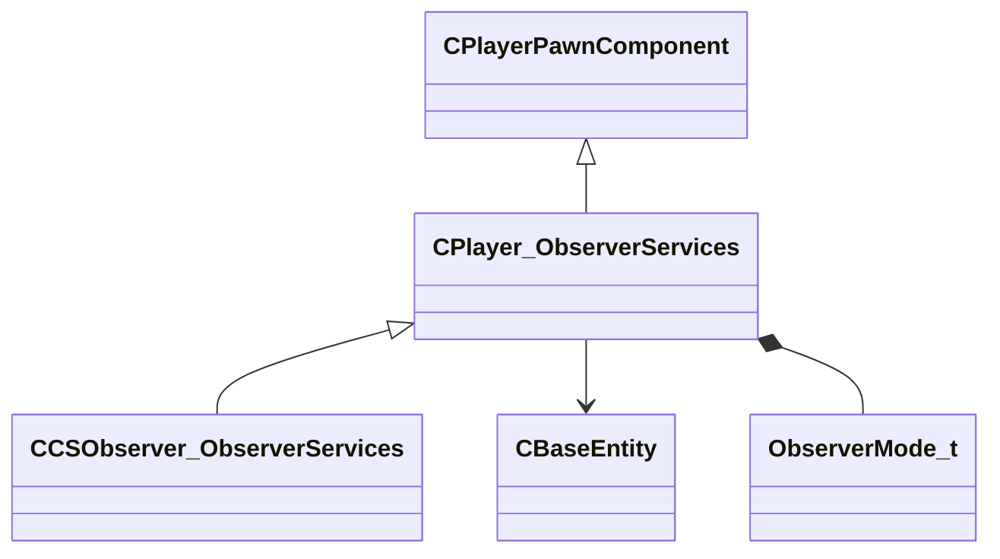

[Schemas](../../schemas.md) / [server](../server.md) / CPlayer_ObserverServices

# CPlayer_ObserverServices

**Kind:** class · **Size:** 88 bytes (`0x58`) · **Align:** 255 · **Module:** server

**Inherits from:** [CPlayerPawnComponent](../server/CPlayerPawnComponent.md)

**Derived by:** [CCSObserver_ObserverServices](../server/CCSObserver_ObserverServices.md)

**Relationships:**

## Memory layout

6 fields (4 declared here, 2 inherited). Offsets are absolute from the object base.

| Offset | Field | Type | From | Annotations |
|--------|-------|------|------|-------------|
| `0x8` | `__m_pChainEntity` | [CNetworkVarChainer](../entity2/CNetworkVarChainer.md) | [CPlayerPawnComponent](../server/CPlayerPawnComponent.md) | `MNotSaved` |
| `0x30` | `m_pComponentGraphController` | [CAnimGraphControllerPtr](../server/CAnimGraphControllerPtr.md) | [CPlayerPawnComponent](../server/CPlayerPawnComponent.md) |  |
| `0x48` | `m_iObserverMode` | uint8 |  |  |
| `0x4c` | `m_hObserverTarget` | CHandle< [CBaseEntity](../server/CBaseEntity.md) > |  |  |
| `0x50` | `m_iObserverLastMode` | [ObserverMode_t](../server/ObserverMode_t.md) |  |  |
| `0x54` | `m_bForcedObserverMode` | bool |  |  |
