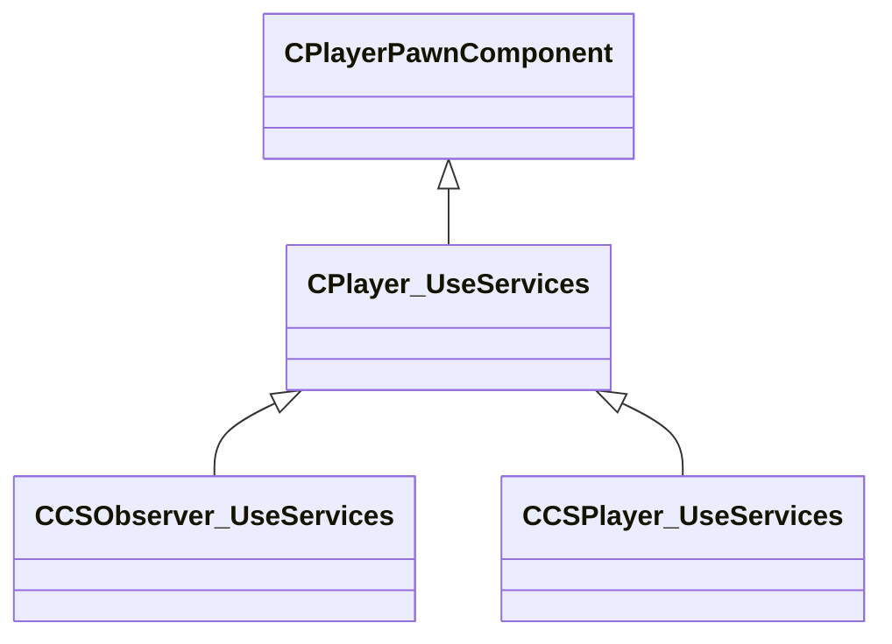

[Schemas](../../schemas.md) / [server](../server.md) / CPlayer_UseServices

# CPlayer_UseServices

**Kind:** class · **Size:** 72 bytes (`0x48`) · **Align:** 255 · **Module:** server

**Inherits from:** [CPlayerPawnComponent](../server/CPlayerPawnComponent.md)

**Derived by:** [CCSObserver_UseServices](../server/CCSObserver_UseServices.md), [CCSPlayer_UseServices](../server/CCSPlayer_UseServices.md)

**Relationships:**

## Memory layout

2 fields (0 declared here, 2 inherited). Offsets are absolute from the object base.

| Offset | Field | Type | From | Annotations |
|--------|-------|------|------|-------------|
| `0x8` | `__m_pChainEntity` | [CNetworkVarChainer](../entity2/CNetworkVarChainer.md) | [CPlayerPawnComponent](../server/CPlayerPawnComponent.md) | `MNotSaved` |
| `0x30` | `m_pComponentGraphController` | [CAnimGraphControllerPtr](../server/CAnimGraphControllerPtr.md) | [CPlayerPawnComponent](../server/CPlayerPawnComponent.md) |  |
