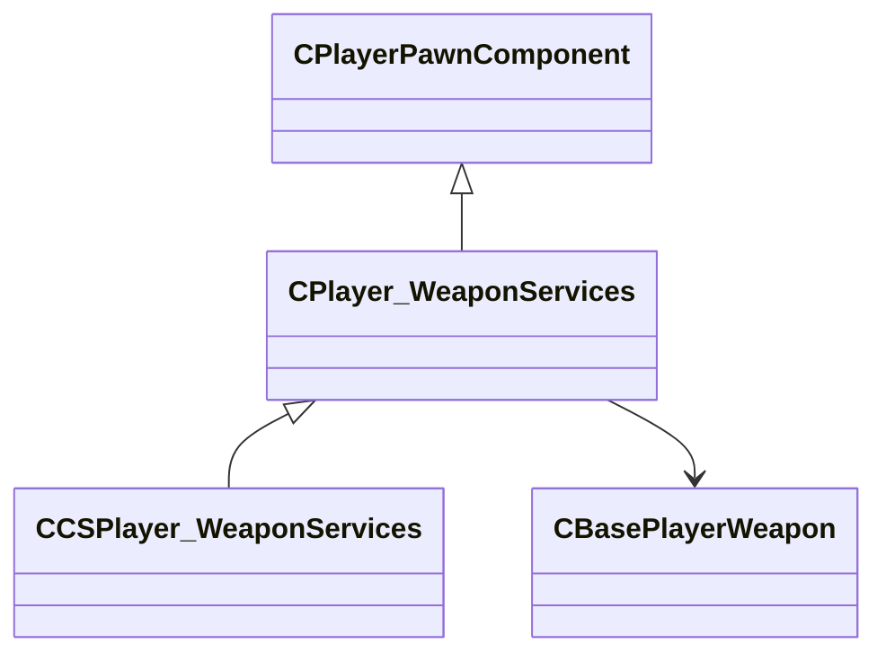

[Schemas](../../schemas.md) / [server](../server.md) / CPlayer_WeaponServices

# CPlayer_WeaponServices

**Kind:** class · **Size:** 176 bytes (`0xb0`) · **Align:** 255 · **Module:** server

**Inherits from:** [CPlayerPawnComponent](../server/CPlayerPawnComponent.md)

**Derived by:** [CCSPlayer_WeaponServices](../server/CCSPlayer_WeaponServices.md)

**Relationships:**

## Memory layout

7 fields (5 declared here, 2 inherited). Offsets are absolute from the object base.

| Offset | Field | Type | From | Annotations |
|--------|-------|------|------|-------------|
| `0x8` | `__m_pChainEntity` | [CNetworkVarChainer](../entity2/CNetworkVarChainer.md) | [CPlayerPawnComponent](../server/CPlayerPawnComponent.md) | `MNotSaved` |
| `0x30` | `m_pComponentGraphController` | [CAnimGraphControllerPtr](../server/CAnimGraphControllerPtr.md) | [CPlayerPawnComponent](../server/CPlayerPawnComponent.md) |  |
| `0x48` | `m_hMyWeapons` | CNetworkUtlVectorBase< CHandle< [CBasePlayerWeapon](../server/CBasePlayerWeapon.md) > > |  |  |
| `0x60` | `m_hActiveWeapon` | CHandle< [CBasePlayerWeapon](../server/CBasePlayerWeapon.md) > |  |  |
| `0x64` | `m_hLastWeapon` | CHandle< [CBasePlayerWeapon](../server/CBasePlayerWeapon.md) > |  |  |
| `0x68` | `m_iAmmo` | uint16[32] |  |  |
| `0xa8` | `m_bPreventWeaponPickup` | bool |  |  |
