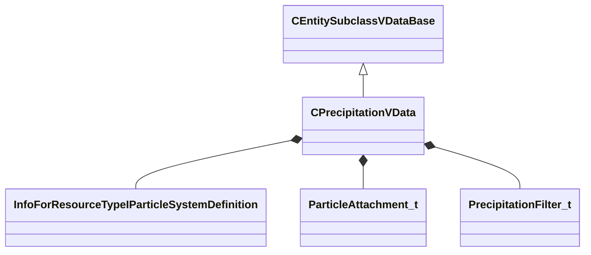

[Schemas](../../schemas.md) / [server](../server.md) / CPrecipitationVData

# CPrecipitationVData

> Source: **Build 25000182** · 2026-08-28 · `windows-x86_64` · schema `0.10.0`

**Kind:** class · **Size:** 752 bytes (`0x2f0`) · **Align:** 8 · **Module:** server

**Twin:** [CPrecipitationVData (client)](../client/CPrecipitationVData.md)

**Inherits from:** [CEntitySubclassVDataBase](../server/CEntitySubclassVDataBase.md)

**Relationships:**

## Memory layout

11 fields (11 declared here, 0 inherited). Offsets are absolute from the object base.

| Offset | Field | Type | From | Annotations |
|--------|-------|------|------|-------------|
| `0x28` | `m_szParticlePrecipitationEffect` | CResourceNameTyped< CWeakHandle< [InfoForResourceTypeIParticleSystemDefinition](../resourcesystem/InfoForResourceTypeIParticleSystemDefinition.md) > > |  |  |
| `0x108` | `m_szParticlePrecipitationPuddleEffect` | CResourceNameTyped< CWeakHandle< [InfoForResourceTypeIParticleSystemDefinition](../resourcesystem/InfoForResourceTypeIParticleSystemDefinition.md) > > |  |  |
| `0x1e8` | `m_szParticlePrecipitationPostEffect` | CResourceNameTyped< CWeakHandle< [InfoForResourceTypeIParticleSystemDefinition](../resourcesystem/InfoForResourceTypeIParticleSystemDefinition.md) > > |  |  |
| `0x2c8` | `m_flInnerDistance` | float32 |  |  |
| `0x2cc` | `m_nAttachType` | [ParticleAttachment_t](../animationsystem/ParticleAttachment_t.md) |  |  |
| `0x2d0` | `m_bBatchSameVolumeType` | bool |  |  |
| `0x2d4` | `m_nRTEnvCP` | int32 |  |  |
| `0x2d8` | `m_nRTEnvCPComponent` | int32 |  |  |
| `0x2e0` | `m_szModifier` | CUtlString |  |  |
| `0x2e8` | `m_nUseSnapshotFromSurfaceGraph` | int32 |  | `MPropertyDescription If set, we will populate a snapshot from the surface graph` |
| `0x2ec` | `m_snapshotFilter` | [PrecipitationFilter_t](../server/PrecipitationFilter_t.md) |  |  |

KV3 class defaults

<pre>{
	&quot;_class&quot;: &quot;CPrecipitationVData&quot;,
	&quot;m_szParticlePrecipitationEffect&quot;: &quot;&quot;,
	&quot;m_szParticlePrecipitationPuddleEffect&quot;: &quot;&quot;,
	&quot;m_szParticlePrecipitationPostEffect&quot;: &quot;&quot;,
	&quot;m_flInnerDistance&quot;: 32.000000,
	&quot;m_nAttachType&quot;: &quot;PATTACH_ABSORIGIN_FOLLOW&quot;,
	&quot;m_bBatchSameVolumeType&quot;: true,
	&quot;m_nRTEnvCP&quot;: -1,
	&quot;m_nRTEnvCPComponent&quot;: 0,
	&quot;m_szModifier&quot;: &quot;&quot;,
	&quot;m_nUseSnapshotFromSurfaceGraph&quot;: -1,
	&quot;m_snapshotFilter&quot;:
	{
		&quot;m_flMaxRadius&quot;: 200.000000
	}
}</pre>

