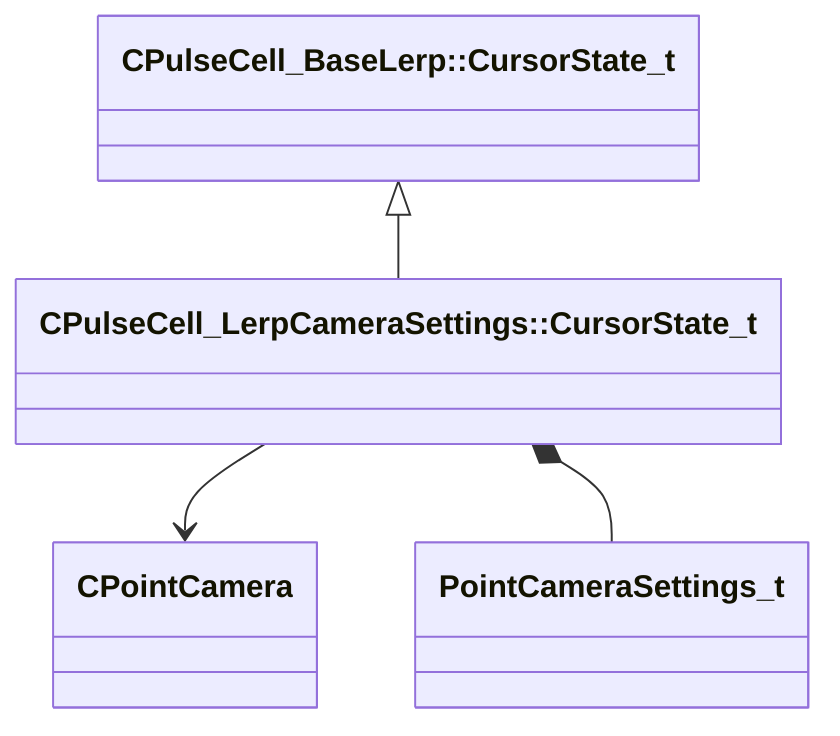

[Schemas](../../schemas.md) / [server](../server.md) / CPulseCell_LerpCameraSettings::CursorState_t

# CPulseCell_LerpCameraSettings::CursorState_t

> Source: **Build 25000182** · 2026-08-28 · `windows-x86_64` · schema `0.10.0`

**Kind:** class · **Size:** 44 bytes (`0x2c`) · **Align:** 4 · **Module:** server

**Twin:** [CPulseCell_LerpCameraSettings::CursorState_t (client)](../client/CPulseCell_LerpCameraSettings.CursorState_t.md)

**Inherits from:** [CPulseCell_BaseLerp::CursorState_t](../pulse_runtime_lib/CPulseCell_BaseLerp.CursorState_t.md)

**Relationships:**

## Memory layout

5 fields (3 declared here, 2 inherited). Offsets are absolute from the object base.

| Offset | Field | Type | From | Annotations |
|--------|-------|------|------|-------------|
| `0x0` | `m_StartTime` | [GameTime_t](../entity2/GameTime_t.md) | [CPulseCell_BaseLerp::CursorState_t](../pulse_runtime_lib/CPulseCell_BaseLerp.CursorState_t.md) |  |
| `0x4` | `m_EndTime` | [GameTime_t](../entity2/GameTime_t.md) | [CPulseCell_BaseLerp::CursorState_t](../pulse_runtime_lib/CPulseCell_BaseLerp.CursorState_t.md) |  |
| `0x8` | `m_hCamera` | CHandle< [CPointCamera](../server/CPointCamera.md) > |  |  |
| `0xc` | `m_OverlaidStart` | [PointCameraSettings_t](../server/PointCameraSettings_t.md) |  |  |
| `0x1c` | `m_OverlaidEnd` | [PointCameraSettings_t](../server/PointCameraSettings_t.md) |  |  |

KV3 class defaults

<pre>{
	&quot;m_StartTime&quot;: null,
	&quot;m_EndTime&quot;: null,
	&quot;m_hCamera&quot;: null,
	&quot;m_OverlaidStart&quot;:
	{
		&quot;m_flNearBlurryDistance&quot;: -1.000000,
		&quot;m_flNearCrispDistance&quot;: -1.000000,
		&quot;m_flFarCrispDistance&quot;: -1.000000,
		&quot;m_flFarBlurryDistance&quot;: -1.000000
	},
	&quot;m_OverlaidEnd&quot;:
	{
		&quot;m_flNearBlurryDistance&quot;: -1.000000,
		&quot;m_flNearCrispDistance&quot;: -1.000000,
		&quot;m_flFarCrispDistance&quot;: -1.000000,
		&quot;m_flFarBlurryDistance&quot;: -1.000000
	}
}</pre>

