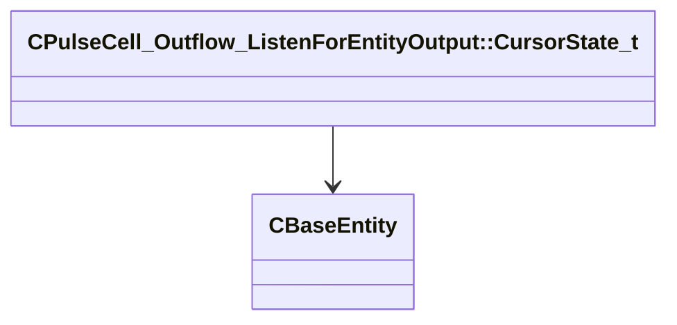

[Schemas](../../schemas.md) / [server](../server.md) / CPulseCell_Outflow_ListenForEntityOutput::CursorState_t

# CPulseCell_Outflow_ListenForEntityOutput::CursorState_t

> Source: **Build 25000182** · 2026-08-28 · `windows-x86_64` · schema `0.10.0`

**Kind:** class · **Size:** 4 bytes (`0x4`) · **Align:** 4 · **Module:** server

**Relationships:**

## Memory layout

1 field (1 declared here, 0 inherited). Offsets are absolute from the object base.

| Offset | Field | Type | From | Annotations |
|--------|-------|------|------|-------------|
| `0x0` | `m_entity` | CHandle< [CBaseEntity](../server/CBaseEntity.md) > |  |  |

KV3 class defaults

<pre>{
	&quot;m_entity&quot;: null
}</pre>

