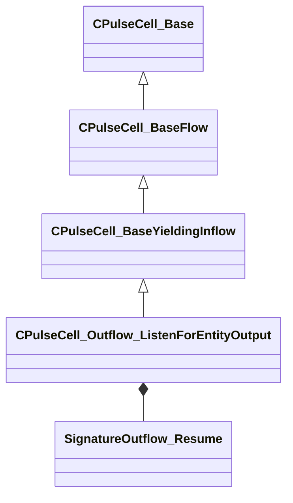

[Schemas](../../schemas.md) / [server](../server.md) / CPulseCell_Outflow_ListenForEntityOutput

# CPulseCell_Outflow_ListenForEntityOutput

> Source: **Build 25000182** · 2026-08-28 · `windows-x86_64` · schema `0.10.0`

**Kind:** class · **Size:** 312 bytes (`0x138`) · **Align:** 8 · **Module:** server

**Inherits from:** [CPulseCell_BaseYieldingInflow](../pulse_runtime_lib/CPulseCell_BaseYieldingInflow.md)

**Metadata:** `MPropertyDescription Waits for the entity to fire a specific output. By default, this listens once, but can be configured to listen until canceled.`, `MPropertyFriendlyName Wait for Entity Output`, `MPulseEditorHeaderIcon tools/images/pulse_editor/inflow_wait.png`, `MPulseEditorSubHeaderText { 'Output'='m_strEntityOutput' 'Param'='m_strEntityOutputParam' 'Until Canceled'='m_bListenUntilCanceled' }`

**Relationships:**

## Memory layout

7 fields (4 declared here, 3 inherited). Offsets are absolute from the object base.

| Offset | Field | Type | From | Annotations |
|--------|-------|------|------|-------------|
| `0x8` | `m_nEditorNodeID` | [PulseDocNodeID_t](../pulse_runtime_lib/PulseDocNodeID_t.md) | [CPulseCell_Base](../pulse_runtime_lib/CPulseCell_Base.md) | `MFgdFromSchemaCompletelySkipField` |
| `0x48` | `m_BaseFlow_OnAfterCancel` | [CPulse_ResumePoint](../pulse_runtime_lib/CPulse_ResumePoint.md) | [CPulseCell_BaseYieldingInflow](../pulse_runtime_lib/CPulseCell_BaseYieldingInflow.md) | `MPulseFGDSkipField` |
| `0x90` | `m_BaseFlow_WhileActive` | [CPulse_ResumePoint](../pulse_runtime_lib/CPulse_ResumePoint.md) | [CPulseCell_BaseYieldingInflow](../pulse_runtime_lib/CPulseCell_BaseYieldingInflow.md) | `MPulseFGDSkipField` |
| `0xd8` | `m_OnFired` | [SignatureOutflow_Resume](../pulse_runtime_lib/SignatureOutflow_Resume.md) |  |  |
| `0x120` | `m_strEntityOutput` | CGlobalSymbol |  |  |
| `0x128` | `m_strEntityOutputParam` | CUtlString |  | `MPropertyDescription Optional output value to match if applicable. Leave empty to match any possible value for the output param.` |
| `0x130` | `m_bListenUntilCanceled` | bool |  | `MPropertyDescription Continue listening for the output until canceled.` |

KV3 class defaults

<pre>{
	&quot;_class&quot;: &quot;CPulseCell_Outflow_ListenForEntityOutput&quot;,
	&quot;m_nEditorNodeID&quot;: -1,
	&quot;m_BaseFlow_OnAfterCancel&quot;:
	{
		&quot;m_SourceOutflowName&quot;: &quot;&quot;,
		&quot;m_nDestChunk&quot;: -1,
		&quot;m_nInstruction&quot;: -1
	},
	&quot;m_BaseFlow_WhileActive&quot;:
	{
		&quot;m_SourceOutflowName&quot;: &quot;&quot;,
		&quot;m_nDestChunk&quot;: -1,
		&quot;m_nInstruction&quot;: -1
	},
	&quot;m_OnFired&quot;:
	{
		&quot;m_SourceOutflowName&quot;: &quot;&quot;,
		&quot;m_nDestChunk&quot;: -1,
		&quot;m_nInstruction&quot;: -1
	},
	&quot;m_strEntityOutput&quot;: &quot;&quot;,
	&quot;m_strEntityOutputParam&quot;: &quot;&quot;,
	&quot;m_bListenUntilCanceled&quot;: false
}</pre>

