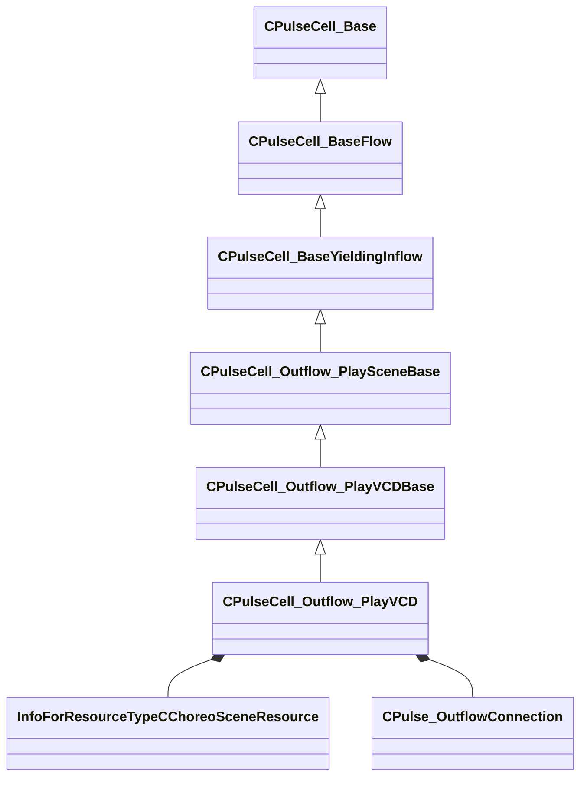

[Schemas](../../schemas.md) / [server](../server.md) / CPulseCell_Outflow_PlayVCD

# CPulseCell_Outflow_PlayVCD

**Kind:** class · **Size:** 488 bytes (`0x1e8`) · **Align:** 8 · **Module:** server

**Inherits from:** [CPulseCell_Outflow_PlayVCDBase](../server/CPulseCell_Outflow_PlayVCDBase.md)

**Relationships:**

## Memory layout

9 fields (4 declared here, 5 inherited). Offsets are absolute from the object base.

| Offset | Field | Type | From | Annotations |
|--------|-------|------|------|-------------|
| `0x8` | `m_nEditorNodeID` | [PulseDocNodeID_t](../pulse_runtime_lib/PulseDocNodeID_t.md) | [CPulseCell_Base](../pulse_runtime_lib/CPulseCell_Base.md) | `MFgdFromSchemaCompletelySkipField` |
| `0x48` | `m_BaseFlow_OnAfterCancel` | [CPulse_ResumePoint](../pulse_runtime_lib/CPulse_ResumePoint.md) | [CPulseCell_BaseYieldingInflow](../pulse_runtime_lib/CPulseCell_BaseYieldingInflow.md) | `MPulseFGDSkipField` |
| `0x90` | `m_BaseFlow_WhileActive` | [CPulse_ResumePoint](../pulse_runtime_lib/CPulse_ResumePoint.md) | [CPulseCell_BaseYieldingInflow](../pulse_runtime_lib/CPulseCell_BaseYieldingInflow.md) | `MPulseFGDSkipField` |
| `0xd8` | `m_OnFinished` | [CPulse_ResumePoint](../pulse_runtime_lib/CPulse_ResumePoint.md) | [CPulseCell_Outflow_PlaySceneBase](../server/CPulseCell_Outflow_PlaySceneBase.md) |  |
| `0x120` | `m_Triggers` | CUtlVector< [CPulse_OutflowConnection](../pulse_runtime_lib/CPulse_OutflowConnection.md) > | [CPulseCell_Outflow_PlaySceneBase](../server/CPulseCell_Outflow_PlaySceneBase.md) |  |
| `0x138` | `m_hChoreoScene` | CStrongHandle< [InfoForResourceTypeCChoreoSceneResource](../resourcesystem/InfoForResourceTypeCChoreoSceneResource.md) > |  |  |
| `0x140` | `m_OnPaused` | [CPulse_OutflowConnection](../pulse_runtime_lib/CPulse_OutflowConnection.md) |  |  |
| `0x188` | `m_OnResumed` | [CPulse_OutflowConnection](../pulse_runtime_lib/CPulse_OutflowConnection.md) |  |  |
| `0x1d0` | `m_OutRequirements` | CUtlVector< [CPulseCell_Outflow_PlayVCD](../server/CPulseCell_Outflow_PlayVCD.md)::VCDRequirementInfo_t > |  |  |

KV3 class defaults

<pre>{
	&quot;_class&quot;: &quot;CPulseCell_Outflow_PlayVCD&quot;,
	&quot;m_nEditorNodeID&quot;: -1,
	&quot;m_BaseFlow_OnAfterCancel&quot;:
	{
		&quot;m_SourceOutflowName&quot;: &quot;&quot;,
		&quot;m_nDestChunk&quot;: -1,
		&quot;m_nInstruction&quot;: -1
	},
	&quot;m_BaseFlow_WhileActive&quot;:
	{
		&quot;m_SourceOutflowName&quot;: &quot;&quot;,
		&quot;m_nDestChunk&quot;: -1,
		&quot;m_nInstruction&quot;: -1
	},
	&quot;m_OnFinished&quot;:
	{
		&quot;m_SourceOutflowName&quot;: &quot;&quot;,
		&quot;m_nDestChunk&quot;: -1,
		&quot;m_nInstruction&quot;: -1
	},
	&quot;m_Triggers&quot;:
	[
	],
	&quot;m_hChoreoScene&quot;: &quot;&quot;,
	&quot;m_OnPaused&quot;:
	{
		&quot;m_SourceOutflowName&quot;: &quot;&quot;,
		&quot;m_nDestChunk&quot;: -1,
		&quot;m_nInstruction&quot;: -1
	},
	&quot;m_OnResumed&quot;:
	{
		&quot;m_SourceOutflowName&quot;: &quot;&quot;,
		&quot;m_nDestChunk&quot;: -1,
		&quot;m_nInstruction&quot;: -1
	},
	&quot;m_OutRequirements&quot;:
	[
	]
}</pre>

