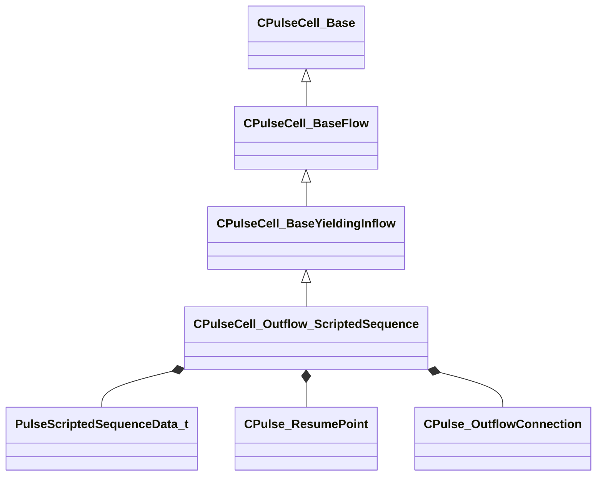

[Schemas](../../schemas.md) / [server](../server.md) / CPulseCell_Outflow_ScriptedSequence

# CPulseCell_Outflow_ScriptedSequence

**Kind:** class · **Size:** 408 bytes (`0x198`) · **Align:** 8 · **Module:** server

**Inherits from:** [CPulseCell_BaseYieldingInflow](../pulse_runtime_lib/CPulseCell_BaseYieldingInflow.md)

**Relationships:**

## Memory layout

12 fields (9 declared here, 3 inherited). Offsets are absolute from the object base.

| Offset | Field | Type | From | Annotations |
|--------|-------|------|------|-------------|
| `0x8` | `m_nEditorNodeID` | [PulseDocNodeID_t](../pulse_runtime_lib/PulseDocNodeID_t.md) | [CPulseCell_Base](../pulse_runtime_lib/CPulseCell_Base.md) | `MFgdFromSchemaCompletelySkipField` |
| `0x48` | `m_BaseFlow_OnAfterCancel` | [CPulse_ResumePoint](../pulse_runtime_lib/CPulse_ResumePoint.md) | [CPulseCell_BaseYieldingInflow](../pulse_runtime_lib/CPulseCell_BaseYieldingInflow.md) | `MPulseFGDSkipField` |
| `0x90` | `m_BaseFlow_WhileActive` | [CPulse_ResumePoint](../pulse_runtime_lib/CPulse_ResumePoint.md) | [CPulseCell_BaseYieldingInflow](../pulse_runtime_lib/CPulseCell_BaseYieldingInflow.md) | `MPulseFGDSkipField` |
| `0xd8` | `m_szSyncGroup` | CUtlString |  |  |
| `0xe0` | `m_nExpectedNumSequencesInSyncGroup` | int32 |  |  |
| `0xe4` | `m_bEnsureOnNavmeshOnFinish` | bool |  |  |
| `0xe5` | `m_bDontTeleportAtEnd` | bool |  |  |
| `0xe6` | `m_bDisallowInterrupts` | bool |  |  |
| `0xe8` | `m_scriptedSequenceDataMain` | [PulseScriptedSequenceData_t](../server/PulseScriptedSequenceData_t.md) |  |  |
| `0x120` | `m_vecAdditionalActors` | CUtlVector< [PulseScriptedSequenceData_t](../server/PulseScriptedSequenceData_t.md) > |  |  |
| `0x138` | `m_OnFinished` | [CPulse_ResumePoint](../pulse_runtime_lib/CPulse_ResumePoint.md) |  |  |
| `0x180` | `m_Triggers` | CUtlVector< [CPulse_OutflowConnection](../pulse_runtime_lib/CPulse_OutflowConnection.md) > |  |  |

KV3 class defaults

<pre>{
	&quot;_class&quot;: &quot;CPulseCell_Outflow_ScriptedSequence&quot;,
	&quot;m_nEditorNodeID&quot;: -1,
	&quot;m_BaseFlow_OnAfterCancel&quot;:
	{
		&quot;m_SourceOutflowName&quot;: &quot;&quot;,
		&quot;m_nDestChunk&quot;: -1,
		&quot;m_nInstruction&quot;: -1
	},
	&quot;m_BaseFlow_WhileActive&quot;:
	{
		&quot;m_SourceOutflowName&quot;: &quot;&quot;,
		&quot;m_nDestChunk&quot;: -1,
		&quot;m_nInstruction&quot;: -1
	},
	&quot;m_szSyncGroup&quot;: &quot;&quot;,
	&quot;m_nExpectedNumSequencesInSyncGroup&quot;: 0,
	&quot;m_bEnsureOnNavmeshOnFinish&quot;: true,
	&quot;m_bDontTeleportAtEnd&quot;: true,
	&quot;m_bDisallowInterrupts&quot;: true,
	&quot;m_scriptedSequenceDataMain&quot;:
	{
		&quot;m_nActorID&quot;: 0,
		&quot;m_szPreIdleSequence&quot;: &quot;&quot;,
		&quot;m_szEntrySequence&quot;: &quot;&quot;,
		&quot;m_szSequence&quot;: &quot;&quot;,
		&quot;m_szExitSequence&quot;: &quot;&quot;,
		&quot;m_nMoveTo&quot;: &quot;eWaitFacing&quot;,
		&quot;m_nMoveToGait&quot;: &quot;eInvalid&quot;,
		&quot;m_nHeldWeaponBehavior&quot;: &quot;eInvalid&quot;,
		&quot;m_bLoopPreIdleSequence&quot;: false,
		&quot;m_bLoopActionSequence&quot;: false,
		&quot;m_bLoopPostIdleSequence&quot;: false,
		&quot;m_bIgnoreLookAt&quot;: false
	},
	&quot;m_vecAdditionalActors&quot;:
	[
	],
	&quot;m_OnFinished&quot;:
	{
		&quot;m_SourceOutflowName&quot;: &quot;&quot;,
		&quot;m_nDestChunk&quot;: -1,
		&quot;m_nInstruction&quot;: -1
	},
	&quot;m_Triggers&quot;:
	[
	]
}</pre>

