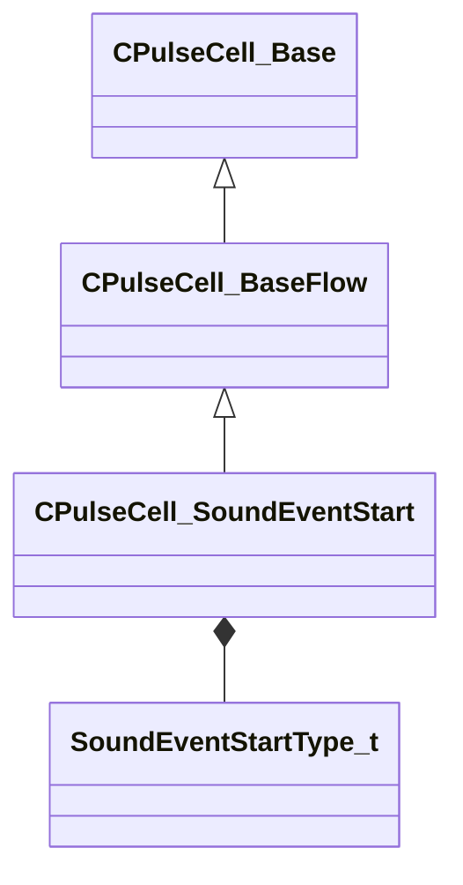

[Schemas](../../schemas.md) / [server](../server.md) / CPulseCell_SoundEventStart

# CPulseCell_SoundEventStart

**Kind:** class · **Size:** 80 bytes (`0x50`) · **Align:** 8 · **Module:** server

**Inherits from:** [CPulseCell_BaseFlow](../pulse_runtime_lib/CPulseCell_BaseFlow.md)

**Metadata:** `MPropertyDescription Starts a sound event, returns a handle that can be used to stop it. Keywords: create, sound, event, audio`, `MPropertyFriendlyName Start Sound Event`

**Relationships:**

## Memory layout

2 fields (1 declared here, 1 inherited). Offsets are absolute from the object base.

| Offset | Field | Type | From | Annotations |
|--------|-------|------|------|-------------|
| `0x8` | `m_nEditorNodeID` | [PulseDocNodeID_t](../pulse_runtime_lib/PulseDocNodeID_t.md) | [CPulseCell_Base](../pulse_runtime_lib/CPulseCell_Base.md) | `MFgdFromSchemaCompletelySkipField` |
| `0x48` | `m_Type` | [SoundEventStartType_t](../!GlobalTypes/SoundEventStartType_t.md) |  |  |

KV3 class defaults

<pre>{
	&quot;_class&quot;: &quot;CPulseCell_SoundEventStart&quot;,
	&quot;m_nEditorNodeID&quot;: -1,
	&quot;m_Type&quot;: &quot;SOUNDEVENT_START_PLAYER&quot;
}</pre>

