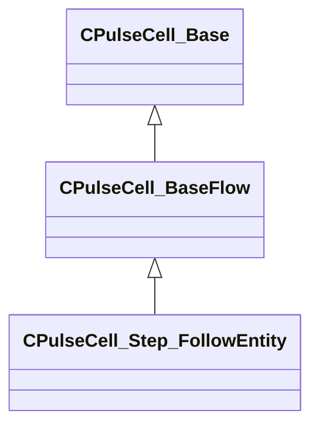

[Schemas](../../schemas.md) / [server](../server.md) / CPulseCell_Step_FollowEntity

# CPulseCell_Step_FollowEntity

> Source: **Build 25000182** · 2026-08-28 · `windows-x86_64` · schema `0.10.0`

**Kind:** class · **Size:** 88 bytes (`0x58`) · **Align:** 8 · **Module:** server

**Inherits from:** [CPulseCell_BaseFlow](../pulse_runtime_lib/CPulseCell_BaseFlow.md)

**Relationships:**

## Memory layout

3 fields (2 declared here, 1 inherited). Offsets are absolute from the object base.

| Offset | Field | Type | From | Annotations |
|--------|-------|------|------|-------------|
| `0x8` | `m_nEditorNodeID` | [PulseDocNodeID_t](../pulse_runtime_lib/PulseDocNodeID_t.md) | [CPulseCell_Base](../pulse_runtime_lib/CPulseCell_Base.md) | `MFgdFromSchemaCompletelySkipField` |
| `0x48` | `m_ParamBoneOrAttachName` | CUtlString |  |  |
| `0x50` | `m_ParamBoneOrAttachNameChild` | CUtlString |  |  |

KV3 class defaults

<pre>{
	&quot;_class&quot;: &quot;CPulseCell_Step_FollowEntity&quot;,
	&quot;m_nEditorNodeID&quot;: -1,
	&quot;m_ParamBoneOrAttachName&quot;: &quot;&quot;,
	&quot;m_ParamBoneOrAttachNameChild&quot;: &quot;&quot;
}</pre>

