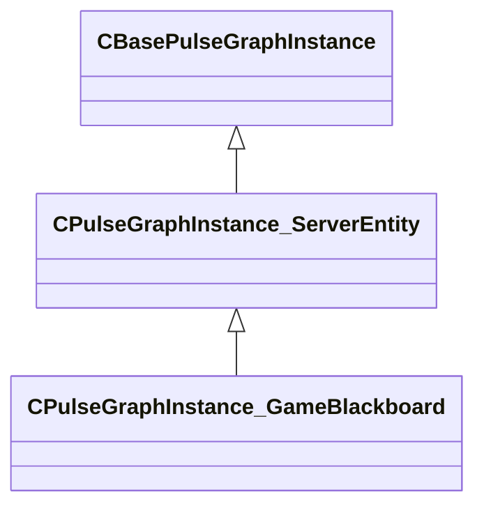

[Schemas](../../schemas.md) / [server](../server.md) / CPulseGraphInstance_GameBlackboard

# CPulseGraphInstance_GameBlackboard

> Source: **Build 25000182** · 2026-08-28 · `windows-x86_64` · schema `0.10.0`

**Kind:** class · **Size:** 472 bytes (`0x1d8`) · **Align:** n/a (unspecified) · **Module:** server

**Inherits from:** [CPulseGraphInstance_ServerEntity](../server/CPulseGraphInstance_ServerEntity.md)

**Relationships:**

## Memory layout

6 fields (0 declared here, 6 inherited). Offsets are absolute from the object base.

| Offset | Field | Type | From | Annotations |
|--------|-------|------|------|-------------|
| `0x1a0` | `m_hOwner` | CHandle< [CBaseEntity](../server/CBaseEntity.md) > | [CPulseGraphInstance_ServerEntity](../server/CPulseGraphInstance_ServerEntity.md) |  |
| `0x1a4` | `m_bActivated` | bool | [CPulseGraphInstance_ServerEntity](../server/CPulseGraphInstance_ServerEntity.md) |  |
| `0x1a8` | `m_sNameFixupStaticPrefix` | CUtlSymbolLarge | [CPulseGraphInstance_ServerEntity](../server/CPulseGraphInstance_ServerEntity.md) |  |
| `0x1b0` | `m_sNameFixupParent` | CUtlSymbolLarge | [CPulseGraphInstance_ServerEntity](../server/CPulseGraphInstance_ServerEntity.md) |  |
| `0x1b8` | `m_sNameFixupLocal` | CUtlSymbolLarge | [CPulseGraphInstance_ServerEntity](../server/CPulseGraphInstance_ServerEntity.md) |  |
| `0x1c0` | `m_sProceduralWorldNameForRelays` | CUtlSymbolLarge | [CPulseGraphInstance_ServerEntity](../server/CPulseGraphInstance_ServerEntity.md) |  |
