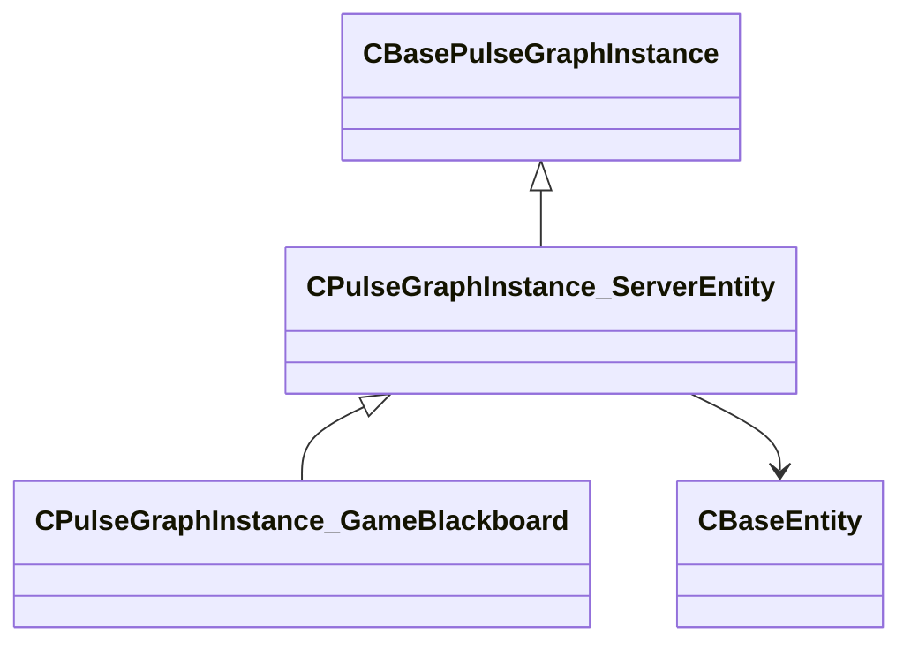

[Schemas](../../schemas.md) / [server](../server.md) / CPulseGraphInstance_ServerEntity

# CPulseGraphInstance_ServerEntity

> Source: **Build 25000182** · 2026-08-28 · `windows-x86_64` · schema `0.10.0`

**Kind:** class · **Size:** 456 bytes (`0x1c8`) · **Align:** n/a (unspecified) · **Module:** server

**Inherits from:** [CBasePulseGraphInstance](../pulse_runtime_lib/CBasePulseGraphInstance.md)

**Derived by:** [CPulseGraphInstance_GameBlackboard](../server/CPulseGraphInstance_GameBlackboard.md)

**Relationships:**

## Memory layout

6 fields (6 declared here, 0 inherited). Offsets are absolute from the object base.

| Offset | Field | Type | From | Annotations |
|--------|-------|------|------|-------------|
| `0x1a0` | `m_hOwner` | CHandle< [CBaseEntity](../server/CBaseEntity.md) > |  |  |
| `0x1a4` | `m_bActivated` | bool |  |  |
| `0x1a8` | `m_sNameFixupStaticPrefix` | CUtlSymbolLarge |  |  |
| `0x1b0` | `m_sNameFixupParent` | CUtlSymbolLarge |  |  |
| `0x1b8` | `m_sNameFixupLocal` | CUtlSymbolLarge |  |  |
| `0x1c0` | `m_sProceduralWorldNameForRelays` | CUtlSymbolLarge |  |  |
