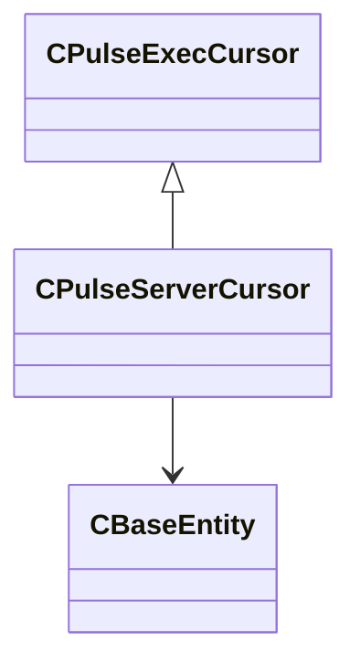

[Schemas](../../schemas.md) / [server](../server.md) / CPulseServerCursor

# CPulseServerCursor

> Source: **Build 25000182** · 2026-08-28 · `windows-x86_64` · schema `0.10.0`

**Kind:** class · **Size:** 240 bytes (`0xf0`) · **Align:** n/a (unspecified) · **Module:** server

**Inherits from:** [CPulseExecCursor](../pulse_runtime_lib/CPulseExecCursor.md)

**Relationships:**

## Memory layout

2 fields (2 declared here, 0 inherited). Offsets are absolute from the object base.

| Offset | Field | Type | From | Annotations |
|--------|-------|------|------|-------------|
| `0xe8` | `m_hActivator` | CHandle< [CBaseEntity](../server/CBaseEntity.md) > |  |  |
| `0xec` | `m_hCaller` | CHandle< [CBaseEntity](../server/CBaseEntity.md) > |  |  |
