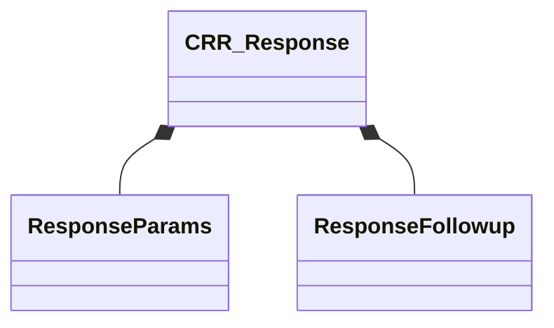

[Schemas](../../schemas.md) / [server](../server.md) / CRR_Response

# CRR_Response

> Source: **Build 25000182** · 2026-08-28 · `windows-x86_64` · schema `0.10.0`

**Kind:** class · **Size:** 464 bytes (`0x1d0`) · **Align:** 8 · **Module:** server

**Relationships:**

## Memory layout

10 fields (10 declared here, 0 inherited). Offsets are absolute from the object base.

| Offset | Field | Type | From | Annotations |
|--------|-------|------|------|-------------|
| `0x0` | `m_Type` | uint8 |  |  |
| `0x1` | `m_szResponseName` | char[192] |  |  |
| `0xc1` | `m_szMatchingRule` | char[128] |  | `MNotSaved` |
| `0x160` | `m_Params` | [ResponseParams](../server/ResponseParams.md) |  |  |
| `0x180` | `m_fMatchScore` | float32 |  | `MNotSaved` |
| `0x184` | `m_bAnyMatchingRulesInCooldown` | bool |  | `MNotSaved` |
| `0x188` | `m_szSpeakerContext` | char* |  | `MNotSaved` |
| `0x190` | `m_szWorldContext` | char* |  | `MNotSaved` |
| `0x198` | `m_Followup` | [ResponseFollowup](../server/ResponseFollowup.md) |  | `MNotSaved` |
| `0x1ca` | `m_recipientFilter` | CUtlSymbol |  | `MNotSaved` |

KV3 class defaults

<pre>{
	&quot;m_Type&quot;: 0,
	&quot;m_szResponseName&quot;: &quot;&quot;,
	&quot;m_Params&quot;:
	{
		&quot;odds&quot;: 100,
		&quot;flags&quot;: 0
	}
}</pre>

