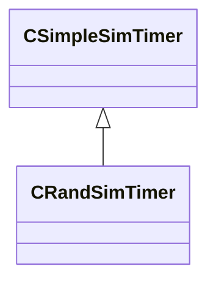

[Schemas](../../schemas.md) / [server](../server.md) / CRandSimTimer

# CRandSimTimer

> Source: **Build 25000182** · 2026-08-28 · `windows-x86_64` · schema `0.10.0`

**Kind:** class · **Size:** 16 bytes (`0x10`) · **Align:** n/a (unspecified) · **Module:** server

**Inherits from:** [CSimpleSimTimer](../server/CSimpleSimTimer.md)

**Relationships:**

## Memory layout

4 fields (2 declared here, 2 inherited). Offsets are absolute from the object base.

| Offset | Field | Type | From | Annotations |
|--------|-------|------|------|-------------|
| `0x0` | `m_flNext` | [GameTime_t](../entity2/GameTime_t.md) | [CSimpleSimTimer](../server/CSimpleSimTimer.md) |  |
| `0x4` | `m_nWorldGroupId` | WorldGroupId_t | [CSimpleSimTimer](../server/CSimpleSimTimer.md) |  |
| `0x8` | `m_flMinInterval` | float32 |  |  |
| `0xc` | `m_flMaxInterval` | float32 |  |  |
