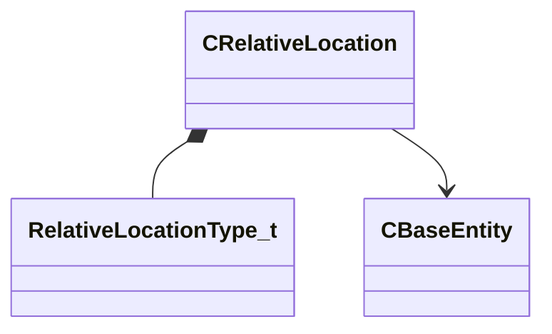

[Schemas](../../schemas.md) / [server](../server.md) / CRelativeLocation

# CRelativeLocation

> Source: **Build 25000182** · 2026-08-28 · `windows-x86_64` · schema `0.10.0`

**Kind:** class · **Size:** 56 bytes (`0x38`) · **Align:** 8 · **Module:** server

**Relationships:**

## Memory layout

4 fields (4 declared here, 0 inherited). Offsets are absolute from the object base.

| Offset | Field | Type | From | Annotations |
|--------|-------|------|------|-------------|
| `0x18` | `m_Type` | [RelativeLocationType_t](../server/RelativeLocationType_t.md) |  |  |
| `0x1c` | `m_vRelativeOffset` | Vector |  |  |
| `0x28` | `m_vWorldSpacePos` | VectorWS |  |  |
| `0x34` | `m_hEntity` | CHandle< [CBaseEntity](../server/CBaseEntity.md) > |  |  |

KV3 class defaults

<pre>{
	&quot;m_Type&quot;: &quot;WORLD_SPACE_POSITION&quot;,
	&quot;m_vRelativeOffset&quot;:
	[
		340282346638528859811704183484516925440.000000,
		340282346638528859811704183484516925440.000000,
		340282346638528859811704183484516925440.000000
	],
	&quot;m_vWorldSpacePos&quot;: null,
	&quot;m_hEntity&quot;: null
}</pre>

