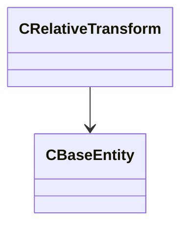

[Schemas](../../schemas.md) / [server](../server.md) / CRelativeTransform

# CRelativeTransform

**Kind:** class · **Size:** 96 bytes (`0x60`) · **Align:** 16 · **Module:** server

**Relationships:**

## Memory layout

4 fields (4 declared here, 0 inherited). Offsets are absolute from the object base.

| Offset | Field | Type | From | Annotations |
|--------|-------|------|------|-------------|
| `0x0` | `m_bTransformIsWorldSpace` | bool |  |  |
| `0x10` | `m_transform` | CTransform |  |  |
| `0x30` | `m_transformWS` | CTransformWS |  |  |
| `0x50` | `m_hEntity` | CHandle< [CBaseEntity](../server/CBaseEntity.md) > |  |  |

KV3 class defaults

<pre>null</pre>

