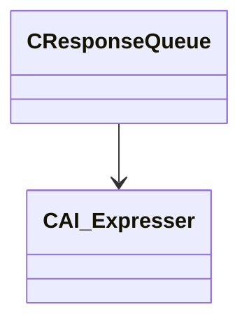

[Schemas](../../schemas.md) / [server](../server.md) / CResponseQueue

# CResponseQueue

> Source: **Build 25000182** · 2026-08-28 · `windows-x86_64` · schema `0.10.0`

**Kind:** class · **Size:** 80 bytes (`0x50`) · **Align:** n/a (unspecified) · **Module:** server

**Relationships:**

## Memory layout

1 field (1 declared here, 0 inherited). Offsets are absolute from the object base.

| Offset | Field | Type | From | Annotations |
|--------|-------|------|------|-------------|
| `0x38` | `m_ExpresserTargets` | CUtlVector< [CAI_Expresser](../server/CAI_Expresser.md)* > |  |  |
