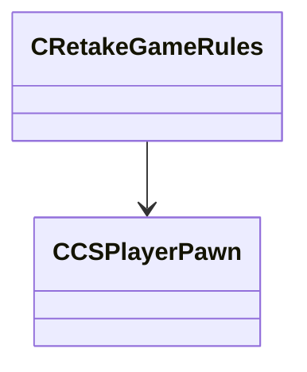

[Schemas](../../schemas.md) / [server](../server.md) / CRetakeGameRules

# CRetakeGameRules

> Source: **Build 25000182** · 2026-08-28 · `windows-x86_64` · schema `0.10.0`

**Kind:** class · **Size:** 496 bytes (`0x1f0`) · **Align:** n/a (unspecified) · **Module:** server

**Relationships:**

## Memory layout

6 fields (6 declared here, 0 inherited). Offsets are absolute from the object base.

| Offset | Field | Type | From | Annotations |
|--------|-------|------|------|-------------|
| `0x138` | `m_nMatchSeed` | int32 |  |  |
| `0x13c` | `m_bBlockersPresent` | bool |  |  |
| `0x13d` | `m_bRoundInProgress` | bool |  |  |
| `0x140` | `m_iFirstSecondHalfRound` | int32 |  |  |
| `0x144` | `m_iBombSite` | int32 |  |  |
| `0x148` | `m_hBombPlanter` | CHandle< [CCSPlayerPawn](../server/CCSPlayerPawn.md) > |  |  |
