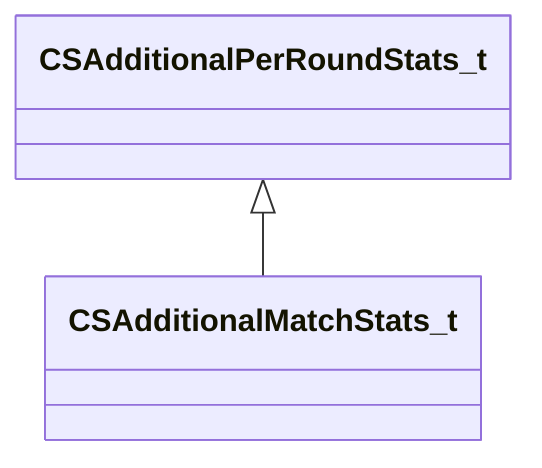

[Schemas](../../schemas.md) / [server](../server.md) / CSAdditionalMatchStats_t

# CSAdditionalMatchStats_t

> Source: **Build 25000182** · 2026-08-28 · `windows-x86_64` · schema `0.10.0`

**Kind:** class · **Size:** 296 bytes (`0x128`) · **Align:** n/a (unspecified) · **Module:** server

**Inherits from:** [CSAdditionalPerRoundStats_t](../server/CSAdditionalPerRoundStats_t.md)

**Relationships:**

## Memory layout

24 fields (12 declared here, 12 inherited). Offsets are absolute from the object base.

| Offset | Field | Type | From | Annotations |
|--------|-------|------|------|-------------|
| `0x0` | `m_numChickensKilled` | int32 | [CSAdditionalPerRoundStats_t](../server/CSAdditionalPerRoundStats_t.md) |  |
| `0x4` | `m_killsWhileBlind` | int32 | [CSAdditionalPerRoundStats_t](../server/CSAdditionalPerRoundStats_t.md) |  |
| `0x8` | `m_bombCarrierkills` | int32 | [CSAdditionalPerRoundStats_t](../server/CSAdditionalPerRoundStats_t.md) |  |
| `0xc` | `m_flBurnDamageInflicted` | float32 | [CSAdditionalPerRoundStats_t](../server/CSAdditionalPerRoundStats_t.md) |  |
| `0x10` | `m_flBlastDamageInflicted` | float32 | [CSAdditionalPerRoundStats_t](../server/CSAdditionalPerRoundStats_t.md) |  |
| `0x14` | `m_iDinks` | int32 | [CSAdditionalPerRoundStats_t](../server/CSAdditionalPerRoundStats_t.md) |  |
| `0x18` | `m_bFreshStartThisRound` | bool | [CSAdditionalPerRoundStats_t](../server/CSAdditionalPerRoundStats_t.md) |  |
| `0x19` | `m_bBombPlantedAndAlive` | bool | [CSAdditionalPerRoundStats_t](../server/CSAdditionalPerRoundStats_t.md) |  |
| `0x1c` | `m_nDefuseStarts` | int32 | [CSAdditionalPerRoundStats_t](../server/CSAdditionalPerRoundStats_t.md) |  |
| `0x20` | `m_nHostagePickUps` | int32 | [CSAdditionalPerRoundStats_t](../server/CSAdditionalPerRoundStats_t.md) |  |
| `0x24` | `m_numTeammatesFlashed` | int32 | [CSAdditionalPerRoundStats_t](../server/CSAdditionalPerRoundStats_t.md) |  |
| `0x28` | `m_strAnnotationsWorkshopId` | CUtlString | [CSAdditionalPerRoundStats_t](../server/CSAdditionalPerRoundStats_t.md) |  |
| `0xf8` | `m_numRoundsSurvivedStreak` | int32 |  |  |
| `0xfc` | `m_maxNumRoundsSurvivedStreak` | int32 |  |  |
| `0x100` | `m_numRoundsSurvivedTotal` | int32 |  |  |
| `0x104` | `m_iRoundsWonWithoutPurchase` | int32 |  |  |
| `0x108` | `m_iRoundsWonWithoutPurchaseTotal` | int32 |  |  |
| `0x10c` | `m_numFirstKills` | int32 |  |  |
| `0x110` | `m_numClutchKills` | int32 |  |  |
| `0x114` | `m_numPistolKills` | int32 |  |  |
| `0x118` | `m_numSniperKills` | int32 |  |  |
| `0x11c` | `m_iNumSuicides` | int32 |  |  |
| `0x120` | `m_iNumTeamKills` | int32 |  |  |
| `0x124` | `m_flTeamDamage` | float32 |  |  |
