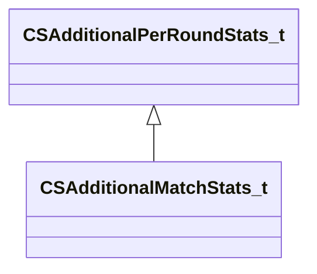

[Schemas](../../schemas.md) / [server](../server.md) / CSAdditionalPerRoundStats_t

# CSAdditionalPerRoundStats_t

> Source: **Build 25000182** · 2026-08-28 · `windows-x86_64` · schema `0.10.0`

**Kind:** class · **Size:** 248 bytes (`0xf8`) · **Align:** n/a (unspecified) · **Module:** server

**Derived by:** [CSAdditionalMatchStats_t](../server/CSAdditionalMatchStats_t.md)

**Relationships:**

## Memory layout

12 fields (12 declared here, 0 inherited). Offsets are absolute from the object base.

| Offset | Field | Type | From | Annotations |
|--------|-------|------|------|-------------|
| `0x0` | `m_numChickensKilled` | int32 |  |  |
| `0x4` | `m_killsWhileBlind` | int32 |  |  |
| `0x8` | `m_bombCarrierkills` | int32 |  |  |
| `0xc` | `m_flBurnDamageInflicted` | float32 |  |  |
| `0x10` | `m_flBlastDamageInflicted` | float32 |  |  |
| `0x14` | `m_iDinks` | int32 |  |  |
| `0x18` | `m_bFreshStartThisRound` | bool |  |  |
| `0x19` | `m_bBombPlantedAndAlive` | bool |  |  |
| `0x1c` | `m_nDefuseStarts` | int32 |  |  |
| `0x20` | `m_nHostagePickUps` | int32 |  |  |
| `0x24` | `m_numTeammatesFlashed` | int32 |  |  |
| `0x28` | `m_strAnnotationsWorkshopId` | CUtlString |  |  |
