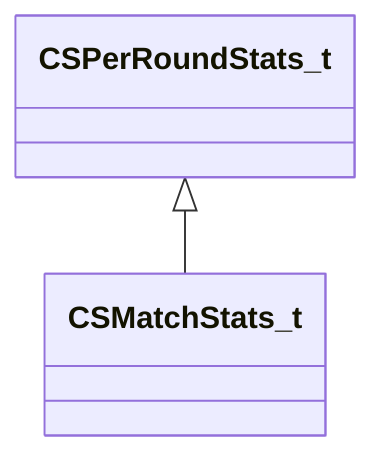

[Schemas](../../schemas.md) / [server](../server.md) / CSPerRoundStats_t

# CSPerRoundStats_t

> Source: **Build 25000182** · 2026-08-28 · `windows-x86_64` · schema `0.10.0`

**Kind:** class · **Size:** 104 bytes (`0x68`) · **Align:** n/a (unspecified) · **Module:** server

**Twin:** [CSPerRoundStats_t (client)](../client/CSPerRoundStats_t.md)

**Derived by:** [CSMatchStats_t](../server/CSMatchStats_t.md)

**Relationships:**

## Memory layout

13 fields (13 declared here, 0 inherited). Offsets are absolute from the object base.

| Offset | Field | Type | From | Annotations |
|--------|-------|------|------|-------------|
| `0x30` | `m_iKills` | int32 |  |  |
| `0x34` | `m_iDeaths` | int32 |  |  |
| `0x38` | `m_iAssists` | int32 |  |  |
| `0x3c` | `m_iDamage` | int32 |  |  |
| `0x40` | `m_iEquipmentValue` | int32 |  |  |
| `0x44` | `m_iMoneySaved` | int32 |  |  |
| `0x48` | `m_iKillReward` | int32 |  |  |
| `0x4c` | `m_iLiveTime` | int32 |  |  |
| `0x50` | `m_iHeadShotKills` | int32 |  |  |
| `0x54` | `m_iObjective` | int32 |  |  |
| `0x58` | `m_iCashEarned` | int32 |  |  |
| `0x5c` | `m_iUtilityDamage` | int32 |  |  |
| `0x60` | `m_iEnemiesFlashed` | int32 |  |  |
