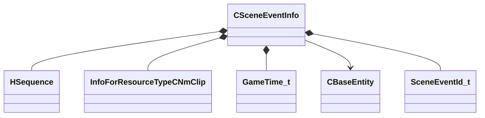

[Schemas](../../schemas.md) / [server](../server.md) / CSceneEventInfo

# CSceneEventInfo

> Source: **Build 25000182** · 2026-08-28 · `windows-x86_64` · schema `0.10.0`

**Kind:** class · **Size:** 120 bytes (`0x78`) · **Align:** n/a (unspecified) · **Module:** server

**Relationships:**

## Memory layout

20 fields (20 declared here, 0 inherited). Offsets are absolute from the object base.

| Offset | Field | Type | From | Annotations |
|--------|-------|------|------|-------------|
| `0x0` | `m_iLayer` | int32 |  |  |
| `0x4` | `m_iPriority` | int32 |  |  |
| `0x8` | `m_hSequence` | [HSequence](../animationsystem/HSequence.md) |  |  |
| `0xc` | `m_flWeight` | float32 |  |  |
| `0x10` | `m_flLastAccumulatedTime` | float32 |  |  |
| `0x14` | `m_flLastJumpFromTime` | float32 |  |  |
| `0x18` | `m_flLastJumpToTime` | float32 |  |  |
| `0x1c` | `m_flLastCycle` | float32 |  |  |
| `0x20` | `m_hAnimClip` | CStrongHandle< [InfoForResourceTypeCNmClip](../resourcesystem/InfoForResourceTypeCNmClip.md) > |  |  |
| `0x28` | `m_sAnimClipSlot` | CGlobalSymbol |  |  |
| `0x30` | `m_sAnimClipSlotWeight` | CGlobalSymbol |  |  |
| `0x38` | `m_bHasArrived` | bool |  |  |
| `0x3c` | `m_nType` | int32 |  |  |
| `0x40` | `m_flNext` | [GameTime_t](../entity2/GameTime_t.md) |  |  |
| `0x44` | `m_bIsGesture` | bool |  |  |
| `0x45` | `m_bShouldRemove` | bool |  |  |
| `0x6c` | `m_hTarget` | CHandle< [CBaseEntity](../server/CBaseEntity.md) > |  |  |
| `0x70` | `m_nSceneEventId` | [SceneEventId_t](../server/SceneEventId_t.md) |  |  |
| `0x74` | `m_bClientSide` | bool |  |  |
| `0x75` | `m_bStarted` | bool |  |  |
