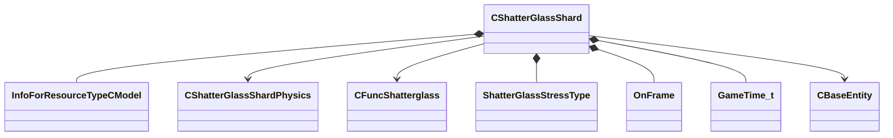

[Schemas](../../schemas.md) / [server](../server.md) / CShatterGlassShard

# CShatterGlassShard

> Source: **Build 25000182** · 2026-08-28 · `windows-x86_64` · schema `0.10.0`

**Kind:** class · **Size:** 184 bytes (`0xb8`) · **Align:** 8 · **Module:** server

**Relationships:**

## Memory layout

28 fields (28 declared here, 0 inherited). Offsets are absolute from the object base.

| Offset | Field | Type | From | Annotations |
|--------|-------|------|------|-------------|
| `0x8` | `m_hShardHandle` | uint32 |  |  |
| `0x10` | `m_vecPanelVertices` | CUtlVector< Vector2D > |  | `MNotSaved` |
| `0x28` | `m_vLocalPanelSpaceOrigin` | Vector2D |  | `MNotSaved` |
| `0x30` | `m_hModel` | CStrongHandle< [InfoForResourceTypeCModel](../resourcesystem/InfoForResourceTypeCModel.md) > |  | `MNotSaved` |
| `0x38` | `m_hPhysicsEntity` | CHandle< [CShatterGlassShardPhysics](../server/CShatterGlassShardPhysics.md) > |  |  |
| `0x3c` | `m_hParentPanel` | CHandle< [CFuncShatterglass](../server/CFuncShatterglass.md) > |  |  |
| `0x40` | `m_hParentShard` | uint32 |  |  |
| `0x44` | `m_ShatterStressType` | [ShatterGlassStressType](../server/ShatterGlassStressType.md) |  |  |
| `0x48` | `m_vecStressVelocity` | Vector |  |  |
| `0x54` | `m_bCreatedModel` | bool |  | `MNotSaved` |
| `0x58` | `m_flLongestEdge` | float32 |  | `MNotSaved` |
| `0x5c` | `m_flShortestEdge` | float32 |  | `MNotSaved` |
| `0x60` | `m_flLongestAcross` | float32 |  | `MNotSaved` |
| `0x64` | `m_flShortestAcross` | float32 |  | `MNotSaved` |
| `0x68` | `m_flSumOfAllEdges` | float32 |  | `MNotSaved` |
| `0x6c` | `m_flArea` | float32 |  | `MNotSaved` |
| `0x70` | `m_nOnFrameEdge` | [OnFrame](../server/OnFrame.md) |  |  |
| `0x74` | `m_nSubShardGeneration` | int32 |  |  |
| `0x78` | `m_vecAverageVertPosition` | Vector2D |  | `MNotSaved` |
| `0x80` | `m_bAverageVertPositionIsValid` | bool |  | `MNotSaved` |
| `0x84` | `m_vecPanelSpaceStressPositionA` | Vector2D |  |  |
| `0x8c` | `m_vecPanelSpaceStressPositionB` | Vector2D |  |  |
| `0x94` | `m_bStressPositionAIsValid` | bool |  |  |
| `0x95` | `m_bStressPositionBIsValid` | bool |  |  |
| `0x96` | `m_bFlaggedForRemoval` | bool |  |  |
| `0x98` | `m_flPhysicsEntitySpawnedAtTime` | [GameTime_t](../entity2/GameTime_t.md) |  |  |
| `0x9c` | `m_hEntityHittingMe` | CHandle< [CBaseEntity](../server/CBaseEntity.md) > |  |  |
| `0xa0` | `m_vecNeighbors` | CUtlVector< uint32 > |  |  |

KV3 class defaults

<pre>{
	&quot;_class&quot;: &quot;CShatterGlassShard&quot;,
	&quot;m_hShardHandle&quot;: 0,
	&quot;m_hPhysicsEntity&quot;: null,
	&quot;m_hParentPanel&quot;: null,
	&quot;m_hParentShard&quot;: 0,
	&quot;m_ShatterStressType&quot;: &quot;SHATTERGLASS_BLUNT&quot;,
	&quot;m_vecStressVelocity&quot;:
	[
		0.000000,
		0.000000,
		0.000000
	],
	&quot;m_nOnFrameEdge&quot;: &quot;ONFRAME_UNKNOWN&quot;,
	&quot;m_nSubShardGeneration&quot;: 0,
	&quot;m_vecPanelSpaceStressPositionA&quot;:
	[
		0.000000,
		0.000000
	],
	&quot;m_vecPanelSpaceStressPositionB&quot;:
	[
		0.000000,
		0.000000
	],
	&quot;m_bStressPositionAIsValid&quot;: false,
	&quot;m_bStressPositionBIsValid&quot;: false,
	&quot;m_bFlaggedForRemoval&quot;: false,
	&quot;m_flPhysicsEntitySpawnedAtTime&quot;: null,
	&quot;m_hEntityHittingMe&quot;: null,
	&quot;m_vecNeighbors&quot;:
	[
	]
}</pre>

