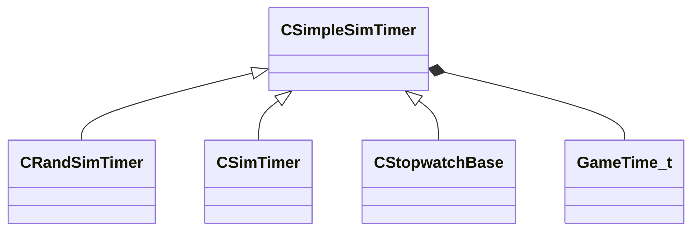

[Schemas](../../schemas.md) / [server](../server.md) / CSimpleSimTimer

# CSimpleSimTimer

**Kind:** class · **Size:** 8 bytes (`0x8`) · **Align:** 255 · **Module:** server

**Derived by:** [CRandSimTimer](../server/CRandSimTimer.md), [CSimTimer](../server/CSimTimer.md), [CStopwatchBase](../server/CStopwatchBase.md)

**Relationships:**

## Memory layout

2 fields (2 declared here, 0 inherited). Offsets are absolute from the object base.

| Offset | Field | Type | From | Annotations |
|--------|-------|------|------|-------------|
| `0x0` | `m_flNext` | [GameTime_t](../entity2/GameTime_t.md) |  |  |
| `0x4` | `m_nWorldGroupId` | WorldGroupId_t |  |  |
