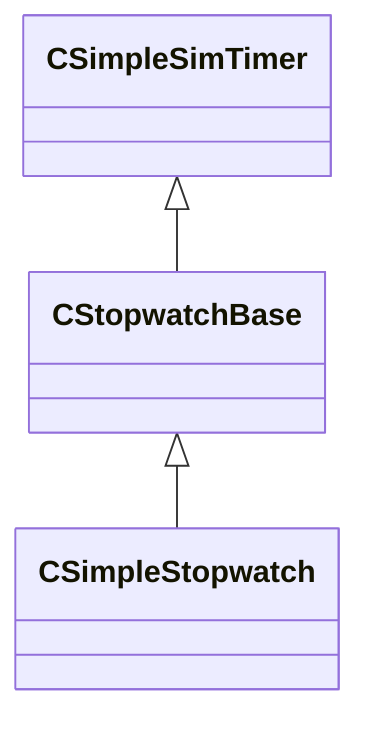

[Schemas](../../schemas.md) / [server](../server.md) / CSimpleStopwatch

# CSimpleStopwatch

**Kind:** class · **Size:** 12 bytes (`0xc`) · **Align:** 255 · **Module:** server

**Inherits from:** [CStopwatchBase](../server/CStopwatchBase.md)

**Relationships:**

## Memory layout

3 fields (0 declared here, 3 inherited). Offsets are absolute from the object base.

| Offset | Field | Type | From | Annotations |
|--------|-------|------|------|-------------|
| `0x0` | `m_flNext` | [GameTime_t](../entity2/GameTime_t.md) | [CSimpleSimTimer](../server/CSimpleSimTimer.md) |  |
| `0x4` | `m_nWorldGroupId` | WorldGroupId_t | [CSimpleSimTimer](../server/CSimpleSimTimer.md) |  |
| `0x8` | `m_bIsRunning` | bool | [CStopwatchBase](../server/CStopwatchBase.md) |  |
