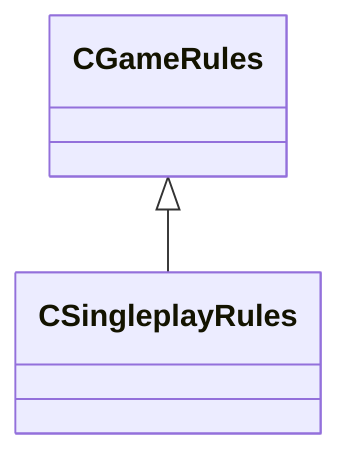

[Schemas](../../schemas.md) / [server](../server.md) / CSingleplayRules

# CSingleplayRules

**Kind:** class · **Size:** 216 bytes (`0xd8`) · **Align:** 255 · **Module:** server

**Inherits from:** [CGameRules](../server/CGameRules.md)

**Relationships:**

## Memory layout

9 fields (1 declared here, 8 inherited). Offsets are absolute from the object base.

| Offset | Field | Type | From | Annotations |
|--------|-------|------|------|-------------|
| `0x8` | `__m_pChainEntity` | [CNetworkVarChainer](../entity2/CNetworkVarChainer.md) | [CGameRules](../server/CGameRules.md) | `MNotSaved` |
| `0x30` | `m_szQuestName` | char[128] | [CGameRules](../server/CGameRules.md) |  |
| `0xb0` | `m_nQuestPhase` | int32 | [CGameRules](../server/CGameRules.md) |  |
| `0xb4` | `m_nLastMatchTime` | uint32 | [CGameRules](../server/CGameRules.md) |  |
| `0xb8` | `m_nLastMatchTime_MatchID64` | uint64 | [CGameRules](../server/CGameRules.md) |  |
| `0xc0` | `m_nTotalPausedTicks` | int32 | [CGameRules](../server/CGameRules.md) |  |
| `0xc4` | `m_nPauseStartTick` | int32 | [CGameRules](../server/CGameRules.md) |  |
| `0xc8` | `m_bGamePaused` | bool | [CGameRules](../server/CGameRules.md) |  |
| `0xd0` | `m_bSinglePlayerGameEnding` | bool |  |  |
