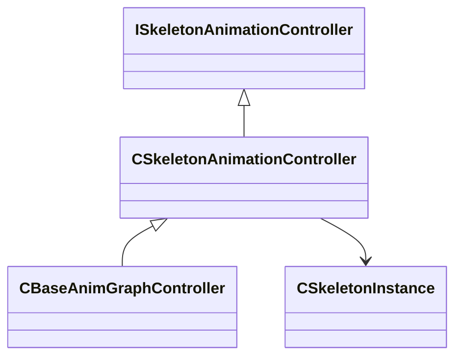

[Schemas](../../schemas.md) / [server](../server.md) / CSkeletonAnimationController

# CSkeletonAnimationController

**Kind:** class · **Size:** 16 bytes (`0x10`) · **Align:** 255 · **Module:** server

**Inherits from:** [ISkeletonAnimationController](../server/ISkeletonAnimationController.md)

**Derived by:** [CBaseAnimGraphController](../server/CBaseAnimGraphController.md)

**Relationships:**

## Memory layout

1 fields (1 declared here, 0 inherited). Offsets are absolute from the object base.

| Offset | Field | Type | From | Annotations |
|--------|-------|------|------|-------------|
| `0x8` | `m_pSkeletonInstance` | [CSkeletonInstance](../server/CSkeletonInstance.md)* |  | `MNotSaved` |
