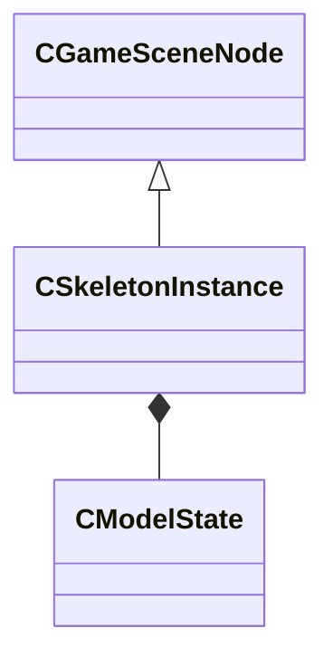

[Schemas](../../schemas.md) / [server](../server.md) / CSkeletonInstance

# CSkeletonInstance

**Kind:** class · **Size:** 1120 bytes (`0x460`) · **Align:** 16 · **Module:** server

**Inherits from:** [CGameSceneNode](../server/CGameSceneNode.md)

**Relationships:**

## Memory layout

42 fields (8 declared here, 34 inherited). Offsets are absolute from the object base.

| Offset | Field | Type | From | Annotations |
|--------|-------|------|------|-------------|
| `0x0` | `m_bBoneMergeFlex` | bitfield:1 | [CGameSceneNode](../server/CGameSceneNode.md) | `MNotSaved` |
| `0x0` | `m_bDirtyBoneMergeBoneToRoot` | bitfield:1 | [CGameSceneNode](../server/CGameSceneNode.md) | `MNotSaved` |
| `0x0` | `m_bDirtyBoneMergeInfo` | bitfield:1 | [CGameSceneNode](../server/CGameSceneNode.md) | `MNotSaved` |
| `0x0` | `m_bDirtyHierarchy` | bitfield:1 | [CGameSceneNode](../server/CGameSceneNode.md) | `MNotSaved` |
| `0x0` | `m_bNetworkedAnglesChanged` | bitfield:1 | [CGameSceneNode](../server/CGameSceneNode.md) | `MNotSaved` |
| `0x0` | `m_bNetworkedPositionChanged` | bitfield:1 | [CGameSceneNode](../server/CGameSceneNode.md) | `MNotSaved` |
| `0x0` | `m_bNetworkedScaleChanged` | bitfield:1 | [CGameSceneNode](../server/CGameSceneNode.md) | `MNotSaved` |
| `0x0` | `m_bWillBeCallingPostDataUpdate` | bitfield:1 | [CGameSceneNode](../server/CGameSceneNode.md) | `MNotSaved` |
| `0x0` | `m_nLatchAbsOrigin` | bitfield:2 | [CGameSceneNode](../server/CGameSceneNode.md) | `MNotSaved` |
| `0x10` | `m_nodeToWorld` | CTransformWS | [CGameSceneNode](../server/CGameSceneNode.md) | `MNotSaved` |
| `0x30` | `m_pOwner` | [CEntityInstance](../entity2/CEntityInstance.md)* | [CGameSceneNode](../server/CGameSceneNode.md) | `MNotSaved` |
| `0x38` | `m_pParent` | [CGameSceneNode](../server/CGameSceneNode.md)* | [CGameSceneNode](../server/CGameSceneNode.md) | `MNotSaved` |
| `0x40` | `m_pChild` | [CGameSceneNode](../server/CGameSceneNode.md)* | [CGameSceneNode](../server/CGameSceneNode.md) | `MNotSaved` |
| `0x48` | `m_pNextSibling` | [CGameSceneNode](../server/CGameSceneNode.md)* | [CGameSceneNode](../server/CGameSceneNode.md) | `MNotSaved` |
| `0x70` | `m_hParent` | [CGameSceneNodeHandle](../server/CGameSceneNodeHandle.md) | [CGameSceneNode](../server/CGameSceneNode.md) |  |
| `0x80` | `m_vecOrigin` | [CNetworkOriginCellCoordQuantizedVector](../server/CNetworkOriginCellCoordQuantizedVector.md) | [CGameSceneNode](../server/CGameSceneNode.md) |  |
| `0xb8` | `m_angRotation` | QAngle | [CGameSceneNode](../server/CGameSceneNode.md) |  |
| `0xc4` | `m_flScale` | float32 | [CGameSceneNode](../server/CGameSceneNode.md) |  |
| `0xc8` | `m_vecAbsOrigin` | VectorWS | [CGameSceneNode](../server/CGameSceneNode.md) |  |
| `0xd4` | `m_angAbsRotation` | QAngle | [CGameSceneNode](../server/CGameSceneNode.md) |  |
| `0xe0` | `m_flAbsScale` | float32 | [CGameSceneNode](../server/CGameSceneNode.md) |  |
| `0xe4` | `m_vecWrappedLocalOrigin` | Vector | [CGameSceneNode](../server/CGameSceneNode.md) | `MNotSaved` |
| `0xf0` | `m_angWrappedLocalRotation` | QAngle | [CGameSceneNode](../server/CGameSceneNode.md) | `MNotSaved` |
| `0xfc` | `m_flWrappedScale` | float32 | [CGameSceneNode](../server/CGameSceneNode.md) | `MNotSaved` |
| `0x100` | `m_nParentAttachmentOrBone` | int16 | [CGameSceneNode](../server/CGameSceneNode.md) | `MNotSaved` |
| `0x102` | `m_bDebugAbsOriginChanges` | bool | [CGameSceneNode](../server/CGameSceneNode.md) | `MNotSaved` |
| `0x103` | `m_bDormant` | bool | [CGameSceneNode](../server/CGameSceneNode.md) |  |
| `0x104` | `m_bForceParentToBeNetworked` | bool | [CGameSceneNode](../server/CGameSceneNode.md) |  |
| `0x107` | `m_nHierarchicalDepth` | uint8 | [CGameSceneNode](../server/CGameSceneNode.md) | `MNotSaved` |
| `0x108` | `m_nHierarchyType` | uint8 | [CGameSceneNode](../server/CGameSceneNode.md) | `MNotSaved` |
| `0x109` | `m_nDoNotSetAnimTimeInInvalidatePhysicsCount` | uint8 | [CGameSceneNode](../server/CGameSceneNode.md) | `MNotSaved` |
| `0x10c` | `m_name` | CUtlStringToken | [CGameSceneNode](../server/CGameSceneNode.md) |  |
| `0x120` | `m_modelState` | [CModelState](../server/CModelState.md) |  |  |
| `0x120` | `m_hierarchyAttachName` | CUtlStringToken | [CGameSceneNode](../server/CGameSceneNode.md) |  |
| `0x124` | `m_flClientLocalScale` | float32 | [CGameSceneNode](../server/CGameSceneNode.md) |  |
| `0x3b0` | `m_bUseParentRenderBounds` | bool |  | `MNotSaved` |
| `0x3b1` | `m_bDisableSolidCollisionsForHierarchy` | bool |  |  |
| `0x3b2` | `m_bDirtyMotionType` | bool |  | `MNotSaved` |
| `0x3b3` | `m_bIsGeneratingLatchedParentSpaceState` | bool |  | `MNotSaved` |
| `0x3b8` | `m_materialGroup` | CUtlStringToken |  |  |
| `0x3bc` | `m_nHitboxSet` | uint8 |  |  |
| `0x41c` | `m_bForceServerConstraintsEnabled` | bool |  |  |
