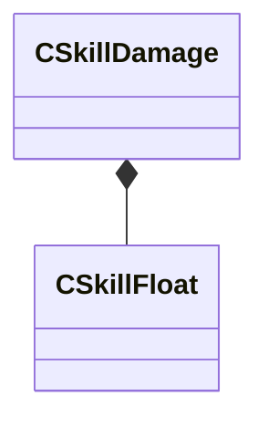

[Schemas](../../schemas.md) / [server](../server.md) / CSkillDamage

# CSkillDamage

> Source: **Build 25000182** · 2026-08-28 · `windows-x86_64` · schema `0.10.0`

**Kind:** class · **Size:** 24 bytes (`0x18`) · **Align:** 4 · **Module:** server

**Relationships:**

## Memory layout

3 fields (3 declared here, 0 inherited). Offsets are absolute from the object base.

| Offset | Field | Type | From | Annotations |
|--------|-------|------|------|-------------|
| `0x0` | `m_flDamage` | [CSkillFloat](../server/CSkillFloat.md) |  | `MPropertyDescription Damage Dealt (in the case of NPC vs NPC damage, medium skill times the NPC damage scalar is used)` |
| `0x10` | `m_flNPCDamageScalarVsNPC` | float32 |  | `MPropertyDescription Damage Scalar for NPC vs NPC cases` |
| `0x14` | `m_flPhysicsForceDamage` | float32 |  | `MPropertyDescription If specified, the damage used to compute physics forces. Otherwise normal damage is used (and is not scaled by the NPC damage scalar.` |

KV3 class defaults

<pre>{
	&quot;m_flDamage&quot;: 0.000000,
	&quot;m_flNPCDamageScalarVsNPC&quot;: 1.000000,
	&quot;m_flPhysicsForceDamage&quot;: 0.000000
}</pre>

