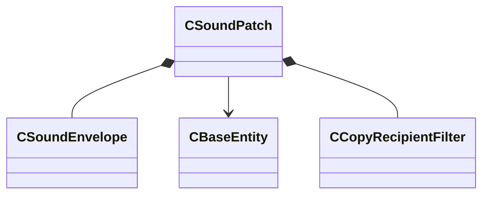

[Schemas](../../schemas.md) / [server](../server.md) / CSoundPatch

# CSoundPatch

> Source: **Build 25000182** · 2026-08-28 · `windows-x86_64` · schema `0.10.0`

**Kind:** class · **Size:** 176 bytes (`0xb0`) · **Align:** n/a (unspecified) · **Module:** server

**Relationships:**

## Memory layout

13 fields (13 declared here, 0 inherited). Offsets are absolute from the object base.

| Offset | Field | Type | From | Annotations |
|--------|-------|------|------|-------------|
| `0x8` | `m_pitch` | [CSoundEnvelope](../server/CSoundEnvelope.md) |  |  |
| `0x18` | `m_volume` | [CSoundEnvelope](../server/CSoundEnvelope.md) |  |  |
| `0x3c` | `m_shutdownTime` | float32 |  |  |
| `0x40` | `m_flLastTime` | float32 |  |  |
| `0x48` | `m_iszSoundScriptName` | CUtlSymbolLarge |  |  |
| `0x50` | `m_hEnt` | CHandle< [CBaseEntity](../server/CBaseEntity.md) > |  |  |
| `0x54` | `m_soundEntityIndex` | CEntityIndex |  | `MNotSaved` |
| `0x58` | `m_soundOrigin` | VectorWS |  | `MNotSaved` |
| `0x64` | `m_isPlaying` | int32 |  |  |
| `0x68` | `m_Filter` | [CCopyRecipientFilter](../server/CCopyRecipientFilter.md) |  |  |
| `0xa0` | `m_flCloseCaptionDuration` | float32 |  |  |
| `0xa4` | `m_bUpdatedSoundOrigin` | bool |  | `MNotSaved` |
| `0xa8` | `m_iszClassName` | CUtlSymbolLarge |  | `MNotSaved` |
