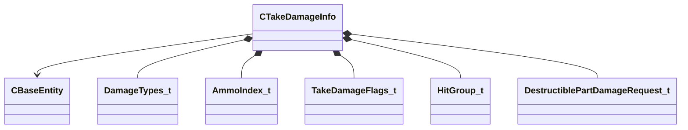

[Schemas](../../schemas.md) / [server](../server.md) / CTakeDamageInfo

# CTakeDamageInfo

**Kind:** class · **Size:** 280 bytes (`0x118`) · **Align:** 8 · **Module:** server

**Relationships:**

## Memory layout

22 fields (22 declared here, 0 inherited). Offsets are absolute from the object base.

| Offset | Field | Type | From | Annotations |
|--------|-------|------|------|-------------|
| `0x8` | `m_vecDamageForce` | Vector |  |  |
| `0x14` | `m_vecDamagePosition` | VectorWS |  |  |
| `0x20` | `m_vecReportedPosition` | VectorWS |  |  |
| `0x2c` | `m_vecDamageDirection` | Vector |  |  |
| `0x38` | `m_hInflictor` | CHandle< [CBaseEntity](../server/CBaseEntity.md) > |  |  |
| `0x3c` | `m_hAttacker` | CHandle< [CBaseEntity](../server/CBaseEntity.md) > |  |  |
| `0x40` | `m_hAbility` | CHandle< [CBaseEntity](../server/CBaseEntity.md) > |  |  |
| `0x44` | `m_flDamage` | float32 |  |  |
| `0x48` | `m_flTotalledDamage` | float32 |  |  |
| `0x4c` | `m_bitsDamageType` | [DamageTypes_t](../!GlobalTypes/DamageTypes_t.md) |  |  |
| `0x50` | `m_iDamageCustom` | int32 |  |  |
| `0x54` | `m_iAmmoType` | [AmmoIndex_t](../server/AmmoIndex_t.md) |  |  |
| `0x60` | `m_flOriginalDamage` | float32 |  |  |
| `0x64` | `m_bShouldBleed` | bool |  |  |
| `0x65` | `m_bShouldSpark` | bool |  |  |
| `0x70` | `m_nDamageFlags` | [TakeDamageFlags_t](../!GlobalTypes/TakeDamageFlags_t.md) |  |  |
| `0x78` | `m_iHitGroupId` | [HitGroup_t](../!GlobalTypes/HitGroup_t.md) |  |  |
| `0x7c` | `m_nNumObjectsPenetrated` | int32 |  |  |
| `0x80` | `m_flFriendlyFireDamageReductionRatio` | float32 |  |  |
| `0x84` | `m_bStoppedBullet` | bool |  |  |
| `0x100` | `m_DestructibleHitGroupRequests` | CUtlLeanVector< [DestructiblePartDamageRequest_t](../server/DestructiblePartDamageRequest_t.md) > |  |  |
| `0x110` | `m_bInTakeDamageFlow` | bool |  | `MNotSaved` |

KV3 class defaults

<pre>{
	&quot;_class&quot;: &quot;CTakeDamageInfo&quot;,
	&quot;m_vecDamageForce&quot;:
	[
		0.000000,
		0.000000,
		0.000000
	],
	&quot;m_vecDamagePosition&quot;: null,
	&quot;m_vecReportedPosition&quot;: null,
	&quot;m_vecDamageDirection&quot;:
	[
		0.000000,
		0.000000,
		0.000000
	],
	&quot;m_hInflictor&quot;: null,
	&quot;m_hAttacker&quot;: null,
	&quot;m_hAbility&quot;: null,
	&quot;m_flDamage&quot;: 0.000000,
	&quot;m_flTotalledDamage&quot;: 0.000000,
	&quot;m_bitsDamageType&quot;: &quot;&quot;,
	&quot;m_iDamageCustom&quot;: 0,
	&quot;m_iAmmoType&quot;: &quot;&quot;,
	&quot;m_flOriginalDamage&quot;: 0.000000,
	&quot;m_bShouldBleed&quot;: false,
	&quot;m_bShouldSpark&quot;: false,
	&quot;m_nDamageFlags&quot;: &quot;&quot;,
	&quot;m_iHitGroupId&quot;: &quot;HITGROUP_INVALID&quot;,
	&quot;m_nNumObjectsPenetrated&quot;: 0,
	&quot;m_flFriendlyFireDamageReductionRatio&quot;: 1.000000,
	&quot;m_bStoppedBullet&quot;: false,
	&quot;m_DestructibleHitGroupRequests&quot;:
	[
	]
}</pre>

