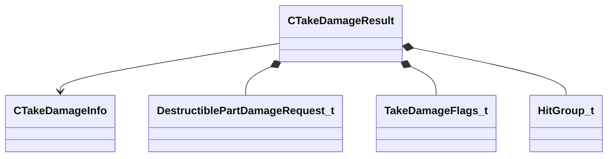

[Schemas](../../schemas.md) / [server](../server.md) / CTakeDamageResult

# CTakeDamageResult

**Kind:** class · **Size:** 96 bytes (`0x60`) · **Align:** 8 · **Module:** server

**Relationships:**

## Memory layout

15 fields (15 declared here, 0 inherited). Offsets are absolute from the object base.

| Offset | Field | Type | From | Annotations |
|--------|-------|------|------|-------------|
| `0x0` | `m_pOriginatingInfo` | [CTakeDamageInfo](../server/CTakeDamageInfo.md)* |  | `MKV3TransferSaveOpsForField GetTakeDamageConstPtrSaveRestoreOps` |
| `0x8` | `m_DestructibleHitGroupRequests` | CUtlLeanVector< [DestructiblePartDamageRequest_t](../server/DestructiblePartDamageRequest_t.md) > |  |  |
| `0x18` | `m_nHealthLost` | int32 |  |  |
| `0x1c` | `m_nHealthBefore` | int32 |  |  |
| `0x20` | `m_flDamageDealt` | float32 |  |  |
| `0x24` | `m_flPreModifiedDamage` | float32 |  |  |
| `0x28` | `m_vDamagePosition` | VectorWS |  |  |
| `0x34` | `m_nTotalledHealthLost` | int32 |  |  |
| `0x38` | `m_flTotalledDamageDealt` | float32 |  |  |
| `0x3c` | `m_flTotalledPreModifiedDamage` | float32 |  |  |
| `0x40` | `m_flNewDamageAccumulatorValue` | float32 |  |  |
| `0x48` | `m_nDamageFlags` | [TakeDamageFlags_t](../!GlobalTypes/TakeDamageFlags_t.md) |  |  |
| `0x50` | `m_bWasDamageSuppressed` | bool |  |  |
| `0x51` | `m_bSuppressFlinch` | bool |  |  |
| `0x54` | `m_nOverrideFlinchHitGroup` | [HitGroup_t](../!GlobalTypes/HitGroup_t.md) |  |  |

KV3 class defaults

<pre>{
	&quot;m_pOriginatingInfo&quot;:
	{
		&quot;_class&quot;: &quot;CTakeDamageInfo&quot;,
		&quot;m_vecDamageForce&quot;:
		[
			0.000000,
			0.000000,
			0.000000
		],
		&quot;m_vecDamagePosition&quot;: null,
		&quot;m_vecReportedPosition&quot;: null,
		&quot;m_vecDamageDirection&quot;:
		[
			0.000000,
			0.000000,
			0.000000
		],
		&quot;m_hInflictor&quot;: null,
		&quot;m_hAttacker&quot;: null,
		&quot;m_hAbility&quot;: null,
		&quot;m_flDamage&quot;: 0.000000,
		&quot;m_flTotalledDamage&quot;: 0.000000,
		&quot;m_bitsDamageType&quot;: &quot;&quot;,
		&quot;m_iDamageCustom&quot;: 0,
		&quot;m_iAmmoType&quot;: &quot;&quot;,
		&quot;m_flOriginalDamage&quot;: 0.000000,
		&quot;m_bShouldBleed&quot;: false,
		&quot;m_bShouldSpark&quot;: false,
		&quot;m_nDamageFlags&quot;: &quot;&quot;,
		&quot;m_iHitGroupId&quot;: &quot;HITGROUP_INVALID&quot;,
		&quot;m_nNumObjectsPenetrated&quot;: 0,
		&quot;m_flFriendlyFireDamageReductionRatio&quot;: 1.000000,
		&quot;m_bStoppedBullet&quot;: false,
		&quot;m_DestructibleHitGroupRequests&quot;:
		[
		]
	},
	&quot;m_DestructibleHitGroupRequests&quot;:
	[
	],
	&quot;m_nHealthLost&quot;: 0,
	&quot;m_nHealthBefore&quot;: 0,
	&quot;m_flDamageDealt&quot;: 0.000000,
	&quot;m_flPreModifiedDamage&quot;: 0.000000,
	&quot;m_vDamagePosition&quot;: null,
	&quot;m_nTotalledHealthLost&quot;: 0,
	&quot;m_flTotalledDamageDealt&quot;: 0.000000,
	&quot;m_flTotalledPreModifiedDamage&quot;: 0.000000,
	&quot;m_flNewDamageAccumulatorValue&quot;: 0.000000,
	&quot;m_nDamageFlags&quot;: &quot;&quot;,
	&quot;m_bWasDamageSuppressed&quot;: false,
	&quot;m_bSuppressFlinch&quot;: false,
	&quot;m_nOverrideFlinchHitGroup&quot;: &quot;HITGROUP_INVALID&quot;
}</pre>

