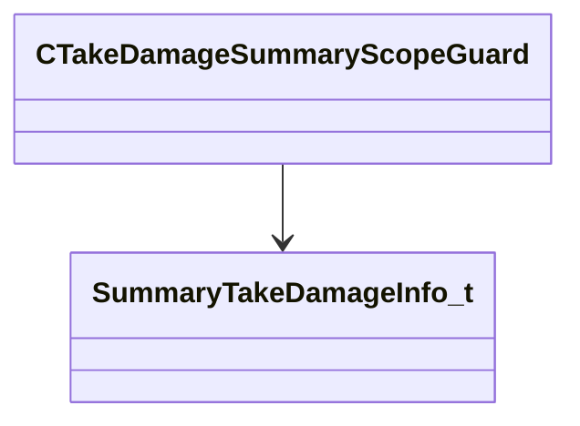

[Schemas](../../schemas.md) / [server](../server.md) / CTakeDamageSummaryScopeGuard

# CTakeDamageSummaryScopeGuard

**Kind:** class · **Size:** 32 bytes (`0x20`) · **Align:** 255 · **Module:** server

**Relationships:**

## Memory layout

1 fields (1 declared here, 0 inherited). Offsets are absolute from the object base.

| Offset | Field | Type | From | Annotations |
|--------|-------|------|------|-------------|
| `0x8` | `m_vecSummaries` | CUtlVector< [SummaryTakeDamageInfo_t](../server/SummaryTakeDamageInfo_t.md)* > |  |  |
