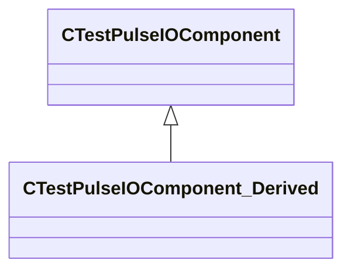

[Schemas](../../schemas.md) / [server](../server.md) / CTestPulseIOComponent

# CTestPulseIOComponent

> Source: **Build 25000182** · 2026-08-28 · `windows-x86_64` · schema `0.10.0`

**Kind:** class · **Size:** 48 bytes (`0x30`) · **Align:** 8 · **Module:** server

**Derived by:** [CTestPulseIOComponent_Derived](../server/CTestPulseIOComponent_Derived.md)

**Relationships:**

## Memory layout

2 fields (2 declared here, 0 inherited). Offsets are absolute from the object base.

| Offset | Field | Type | From | Annotations |
|--------|-------|------|------|-------------|
| `0x8` | `m_ComponentData` | CUtlString |  |  |
| `0x10` | `m_OnComponentTestFunc` | CEntityOutputTemplate< CUtlSymbolLarge > |  |  |

KV3 class defaults

<pre>{
	&quot;_class&quot;: &quot;CTestPulseIOComponent&quot;,
	&quot;m_ComponentData&quot;: &quot;DefaultComponentString&quot;,
	&quot;m_OnComponentTestFunc&quot;:
	{
		&quot;m_Value&quot;: &quot;&quot;
	}
}</pre>

