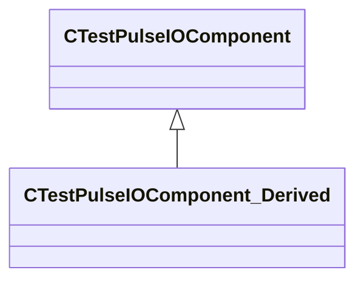

[Schemas](../../schemas.md) / [server](../server.md) / CTestPulseIOComponent_Derived

# CTestPulseIOComponent_Derived

**Kind:** class · **Size:** 48 bytes (`0x30`) · **Align:** 8 · **Module:** server

**Inherits from:** [CTestPulseIOComponent](../server/CTestPulseIOComponent.md)

**Relationships:**

## Memory layout

2 fields (0 declared here, 2 inherited). Offsets are absolute from the object base.

| Offset | Field | Type | From | Annotations |
|--------|-------|------|------|-------------|
| `0x8` | `m_ComponentData` | CUtlString | [CTestPulseIOComponent](../server/CTestPulseIOComponent.md) |  |
| `0x10` | `m_OnComponentTestFunc` | CEntityOutputTemplate< CUtlSymbolLarge > | [CTestPulseIOComponent](../server/CTestPulseIOComponent.md) |  |

KV3 class defaults

<pre>{
	&quot;_class&quot;: &quot;CTestPulseIOComponent_Derived&quot;,
	&quot;m_ComponentData&quot;: &quot;DefaultComponentString&quot;,
	&quot;m_OnComponentTestFunc&quot;:
	{
		&quot;m_Value&quot;: &quot;&quot;
	}
}</pre>

