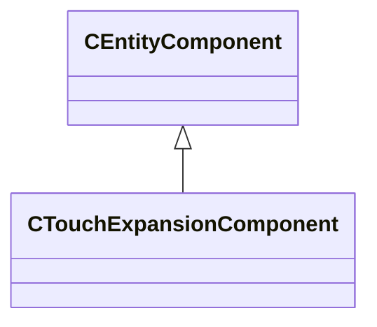

[Schemas](../../schemas.md) / [server](../server.md) / CTouchExpansionComponent

# CTouchExpansionComponent

**Kind:** class · **Size:** 80 bytes (`0x50`) · **Align:** 8 · **Module:** server

**Inherits from:** [CEntityComponent](../entity2/CEntityComponent.md)

**Relationships:**

KV3 class defaults

<pre>{
	&quot;_class&quot;: &quot;CTouchExpansionComponent&quot;
}</pre>

