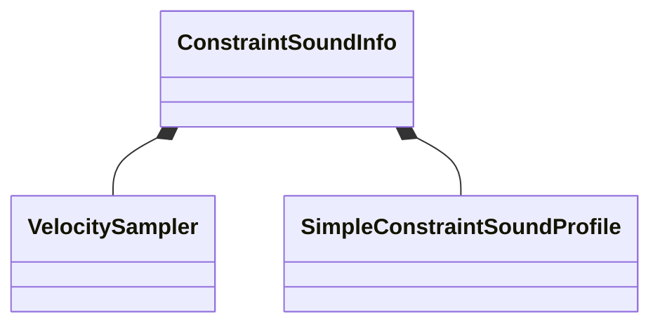

[Schemas](../../schemas.md) / [server](../server.md) / ConstraintSoundInfo

# ConstraintSoundInfo

**Kind:** class · **Size:** 152 bytes (`0x98`) · **Align:** 8 · **Module:** server

**Relationships:**

## Memory layout

10 fields (10 declared here, 0 inherited). Offsets are absolute from the object base.

| Offset | Field | Type | From | Annotations |
|--------|-------|------|------|-------------|
| `0x8` | `m_vSampler` | [VelocitySampler](../server/VelocitySampler.md) |  | `MNotSaved` |
| `0x20` | `m_soundProfile` | [SimpleConstraintSoundProfile](../server/SimpleConstraintSoundProfile.md) |  |  |
| `0x40` | `m_forwardAxis` | Vector |  | `MNotSaved` |
| `0x50` | `m_iszTravelSoundFwd` | CUtlSymbolLarge |  |  |
| `0x58` | `m_iszTravelSoundBack` | CUtlSymbolLarge |  |  |
| `0x78` | `m_iszReversalSoundSmall` | CUtlSymbolLarge |  |  |
| `0x80` | `m_iszReversalSoundMedium` | CUtlSymbolLarge |  |  |
| `0x88` | `m_iszReversalSoundLarge` | CUtlSymbolLarge |  |  |
| `0x90` | `m_bPlayTravelSound` | bool |  | `MNotSaved` |
| `0x91` | `m_bPlayReversalSound` | bool |  | `MNotSaved` |

KV3 class defaults

<pre>{
	&quot;_class&quot;: &quot;ConstraintSoundInfo&quot;,
	&quot;m_soundProfile&quot;:
	{
		&quot;_class&quot;: &quot;SimpleConstraintSoundProfile&quot;,
		&quot;m_flKeyPointMinSoundThreshold&quot;: 0.000000,
		&quot;m_flKeyPointMaxSoundThreshold&quot;: 0.000000,
		&quot;m_reversalSoundThresholdSmall&quot;: 0.000000,
		&quot;m_reversalSoundThresholdMedium&quot;: 0.000000,
		&quot;m_reversalSoundThresholdLarge&quot;: 0.000000
	},
	&quot;m_iszTravelSoundFwd&quot;: &quot;&quot;,
	&quot;m_iszTravelSoundBack&quot;: &quot;&quot;,
	&quot;m_iszReversalSoundSmall&quot;: &quot;&quot;,
	&quot;m_iszReversalSoundMedium&quot;: &quot;&quot;,
	&quot;m_iszReversalSoundLarge&quot;: &quot;&quot;
}</pre>

