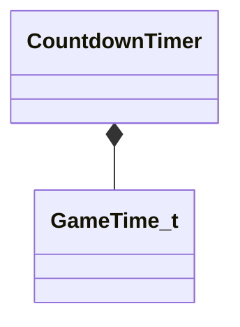

[Schemas](../../schemas.md) / [server](../server.md) / CountdownTimer

# CountdownTimer

> Source: **Build 25000182** · 2026-08-28 · `windows-x86_64` · schema `0.10.0`

**Kind:** class · **Size:** 24 bytes (`0x18`) · **Align:** 8 · **Module:** server

**Twin:** [CountdownTimer (client)](../client/CountdownTimer.md)

**Relationships:**

## Memory layout

4 fields (4 declared here, 0 inherited). Offsets are absolute from the object base.

| Offset | Field | Type | From | Annotations |
|--------|-------|------|------|-------------|
| `0x8` | `m_duration` | float32 |  |  |
| `0xc` | `m_timestamp` | [GameTime_t](../entity2/GameTime_t.md) |  |  |
| `0x10` | `m_timescale` | float32 |  |  |
| `0x14` | `m_nWorldGroupId` | WorldGroupId_t |  |  |

KV3 class defaults

<pre>null</pre>

