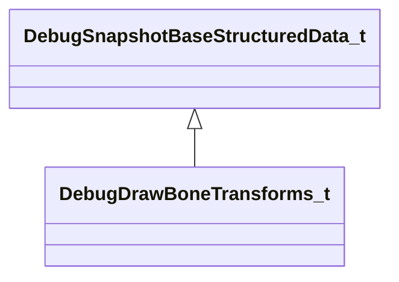

[Schemas](../../schemas.md) / [server](../server.md) / DebugDrawBoneTransforms_t

# DebugDrawBoneTransforms_t

> Source: **Build 25000182** · 2026-08-28 · `windows-x86_64` · schema `0.10.0`

**Kind:** class · **Size:** 4144 bytes (`0x1030`) · **Align:** 16 · **Module:** server

**Inherits from:** [DebugSnapshotBaseStructuredData_t](../server/DebugSnapshotBaseStructuredData_t.md)

**Metadata:** `MPropertyFriendlyName Bone Transforms`

**Relationships:**

## Memory layout

1 field (1 declared here, 0 inherited). Offsets are absolute from the object base.

| Offset | Field | Type | From | Annotations |
|--------|-------|------|------|-------------|
| `0x10` | `vecBones` | CUtlVectorFixedGrowable< CTransform, 128 > |  |  |

KV3 class defaults

<pre>{
	&quot;_class&quot;: &quot;DebugDrawBoneTransforms_t&quot;,
	&quot;vecBones&quot;:
	[
	]
}</pre>

