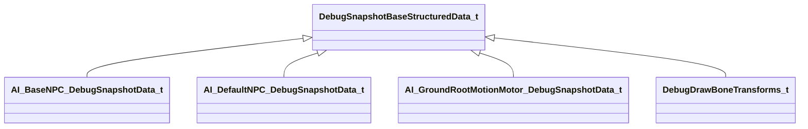

[Schemas](../../schemas.md) / [server](../server.md) / DebugSnapshotBaseStructuredData_t

# DebugSnapshotBaseStructuredData_t

**Kind:** class · **Size:** 8 bytes (`0x8`) · **Align:** 8 · **Module:** server

**Derived by:** [AI_BaseNPC_DebugSnapshotData_t](../server/AI_BaseNPC_DebugSnapshotData_t.md), [AI_DefaultNPC_DebugSnapshotData_t](../server/AI_DefaultNPC_DebugSnapshotData_t.md), [AI_GroundRootMotionMotor_DebugSnapshotData_t](../server/AI_GroundRootMotionMotor_DebugSnapshotData_t.md), [DebugDrawBoneTransforms_t](../server/DebugDrawBoneTransforms_t.md)

**Metadata:** `MPropertyFriendlyName Base Structured Data`

**Relationships:**

KV3 class defaults

<pre>{
	&quot;_class&quot;: &quot;DebugSnapshotBaseStructuredData_t&quot;
}</pre>

