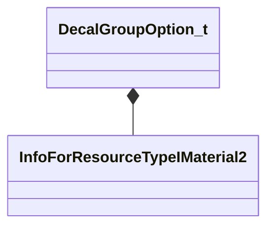

[Schemas](../../schemas.md) / [server](../server.md) / DecalGroupOption_t

# DecalGroupOption_t

> Source: **Build 25000182** · 2026-08-28 · `windows-x86_64` · schema `0.10.0`

**Kind:** class · **Size:** 32 bytes (`0x20`) · **Align:** 8 · **Module:** server

**Relationships:**

## Memory layout

6 fields (6 declared here, 0 inherited). Offsets are absolute from the object base.

| Offset | Field | Type | From | Annotations |
|--------|-------|------|------|-------------|
| `0x0` | `m_hMaterial` | CStrongHandleCopyable< [InfoForResourceTypeIMaterial2](../resourcesystem/InfoForResourceTypeIMaterial2.md) > |  |  |
| `0x8` | `m_sSequenceName` | CGlobalSymbol |  |  |
| `0x10` | `m_flProbability` | float32 |  |  |
| `0x14` | `m_bEnableAngleBetweenNormalAndGravityRange` | bool |  |  |
| `0x18` | `m_flMinAngleBetweenNormalAndGravity` | float32 |  | `MPropertySuppressExpr m_bEnableAngleBetweenNormalAndGravityRange == 0` |
| `0x1c` | `m_flMaxAngleBetweenNormalAndGravity` | float32 |  | `MPropertySuppressExpr m_bEnableAngleBetweenNormalAndGravityRange == 0` |

KV3 class defaults

<pre>{
	&quot;m_hMaterial&quot;: &quot;&quot;,
	&quot;m_sSequenceName&quot;: &quot;&quot;,
	&quot;m_flProbability&quot;: 1.000000,
	&quot;m_bEnableAngleBetweenNormalAndGravityRange&quot;: false,
	&quot;m_flMinAngleBetweenNormalAndGravity&quot;: 0.000000,
	&quot;m_flMaxAngleBetweenNormalAndGravity&quot;: 180.000000
}</pre>

