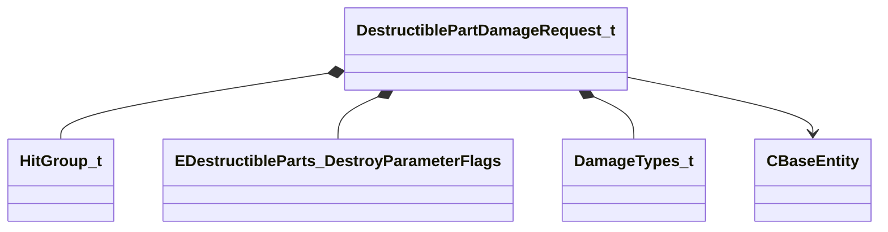

[Schemas](../../schemas.md) / [server](../server.md) / DestructiblePartDamageRequest_t

# DestructiblePartDamageRequest_t

**Kind:** class · **Size:** 60 bytes (`0x3c`) · **Align:** 4 · **Module:** server

**Relationships:**

## Memory layout

10 fields (10 declared here, 0 inherited). Offsets are absolute from the object base.

| Offset | Field | Type | From | Annotations |
|--------|-------|------|------|-------------|
| `0x0` | `m_nHitGroup` | [HitGroup_t](../server/HitGroup_t.md) |  |  |
| `0x4` | `m_nDamageLevel` | int32 |  |  |
| `0x8` | `m_nDesiredHealth` | uint16 |  |  |
| `0xc` | `m_nDestroyFlags` | [EDestructibleParts_DestroyParameterFlags](../server/EDestructibleParts_DestroyParameterFlags.md) |  |  |
| `0x10` | `m_nDamageType` | [DamageTypes_t](../server/DamageTypes_t.md) |  |  |
| `0x14` | `m_flBreakDamage` | float32 |  |  |
| `0x18` | `m_flBreakDamageRadius` | float32 |  |  |
| `0x1c` | `m_hAttacker` | CHandle< [CBaseEntity](../server/CBaseEntity.md) > |  |  |
| `0x20` | `m_vWsBreakDamageOrigin` | VectorWS |  |  |
| `0x2c` | `m_vWsBreakDamageForce` | Vector |  |  |

KV3 class defaults

<pre>{
	&quot;m_nHitGroup&quot;: &quot;HITGROUP_INVALID&quot;,
	&quot;m_nDamageLevel&quot;: -1,
	&quot;m_nDesiredHealth&quot;: 0,
	&quot;m_nDestroyFlags&quot;: &quot;GenerateBreakpieces|SetBodyGroupAndCollisionState|EnableFlinches&quot;,
	&quot;m_nDamageType&quot;: &quot;DMG_BLAST&quot;,
	&quot;m_flBreakDamage&quot;: 0.000000,
	&quot;m_flBreakDamageRadius&quot;: 24.000000,
	&quot;m_hAttacker&quot;: null,
	&quot;m_vWsBreakDamageOrigin&quot;: null,
	&quot;m_vWsBreakDamageForce&quot;:
	[
		1.000000,
		0.000000,
		0.000000
	]
}</pre>

